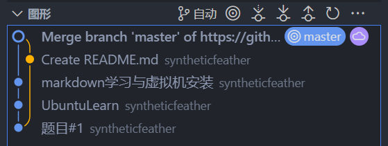
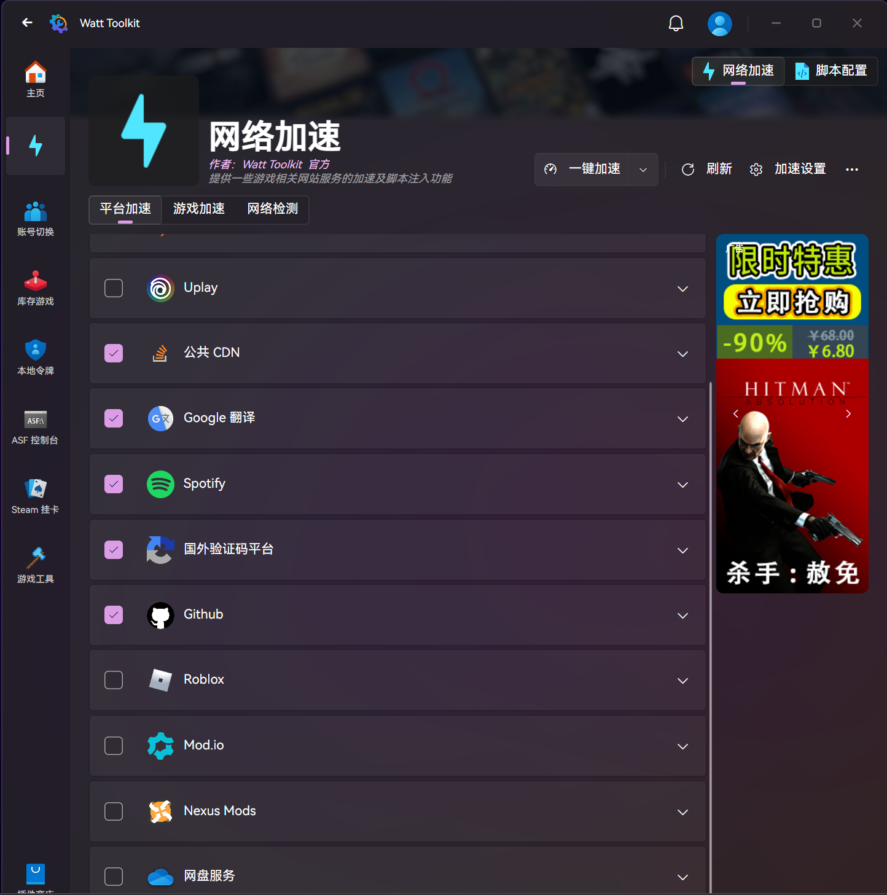
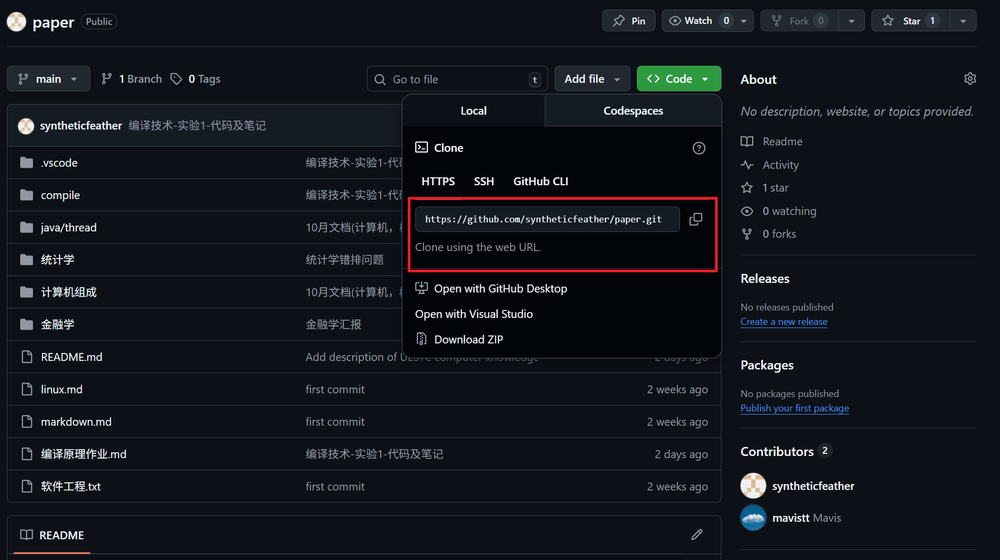
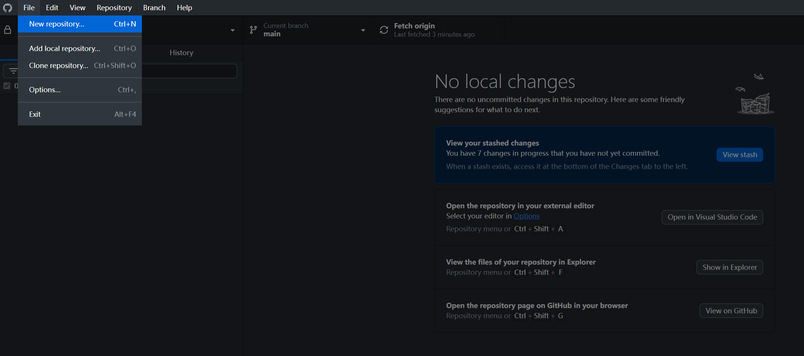
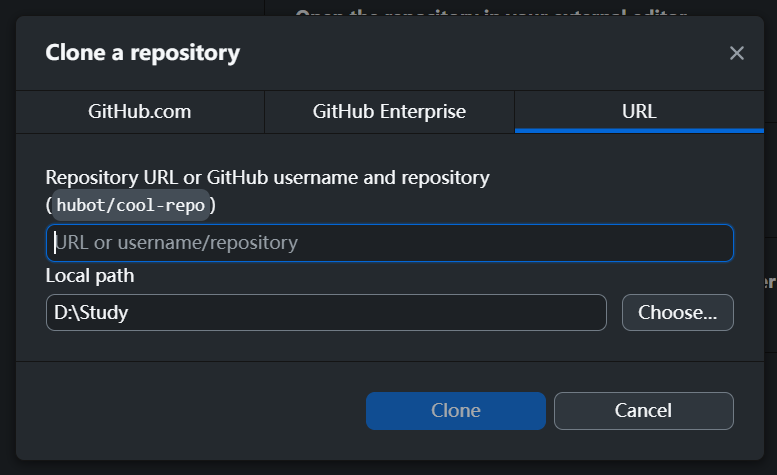
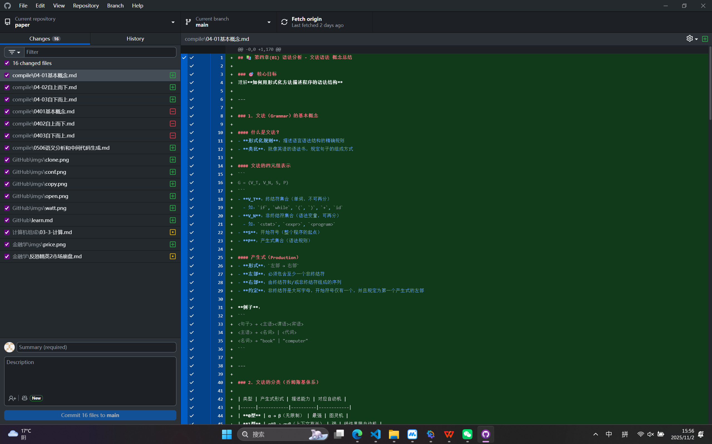
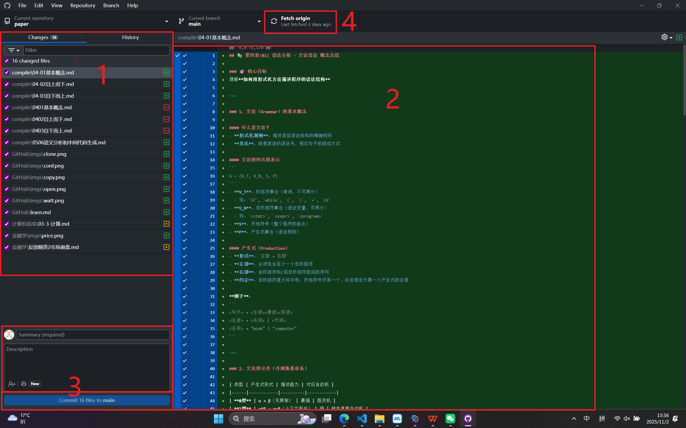

### [我的github库](https://github.com/syntheticfeather/JoTang2025)

## [如不必要学习git的指令，请直接点我跳转到GithubDesktop的使用(点这)](#github-desktop的使用)

# git学习笔记(这部分是理论性和指令性的)

## git的概念
    - git是一个开源的分布式版本控制系统，用于管理代码或其他文件。        
    - git的优点：
        1. 轻量级：git的设计目标就是简单，易于学习和使用。
        2. 代码上传云端，不用U盘拷贝。
        3. 免费开源。
        4. 易于多人合作。
        5. 分布式管理方便版本回退，

## 安装git

`sudo apt-get install git`

检验自己是否安装成功:

`git -v`

    成功输出:
    git version 2.48.1.windows.1

## 配置git

`git config --global user.name "syntheticfeather"`
`git config --global user.email "2391317090@qq.com"`

global是全局仓库设置，如果有多个账号就把--global去掉

## 创建第一个git仓库

### 1.生成git文件:

`git init`

此时在当前目录下会生成一个.git的目录，里面包含了仓库的相关信息。

    Initialized empty Git repository in /home/gcc/test/forgit/.git/
 
### 2.该文件夹里的文件放入提交中:

`git add .`

    直接加入所有文件

`git add 文件名`

    或者指定文件加入

如果文件不存在:

`git add notExist`

报错输出:

    fatal: pathspec '2.' did not match any files

### 3.提交文件到仓库:

`git commit -m "first commit"`

    [master (root-commit) a24e06c] first commit
    1 file changed, 1 insertion(+)
    create mode 100644 1.md

### 4.连接并推送推送到远程仓库:

`git remote add origin https://github.com/syntheticfeather(your_name)/test(your_repo).git`

    远程仓库里面添加库来存储本体仓库。

`git push -u origin master`

    第一次提交，需要加上-u参数，将本地仓库和远程仓库关联起来。

如果没有config，现在就会让你输入用户名和密码:

`git push`

    之后可以简写

## 常见的文件操作:

### 1.查看仓库状态:

`git status`

    可以看到当前仓库的状态，包括文件是否被修改，新增，删除等。

输出:

    On branch master
    Changes to be committed:
    (use "git restore --staged <file>..." to unstage)
        new file:   2.md
    
    Untracked files:
    (use "git add <file>..." to include in what will be committed)
        3.md

### 2.查看提交记录:

`git log`

可以看到提交记录，包括提交的版本号，提交时间，提交人，提交信息等。

    commit b906c3ce07391fedc435986ed29943fa93d3480c (HEAD -> master)
    Author: syntheticfeather <2391317090@qq.com>
    Date:   Fri Sep 5 19:38:38 2025 -0700

        sec mes

    commit a24e06c48f5c38a01896412db2a8de0ef601d35f
    Author: syntheticfeather <2391317090@qq.com>
    Date:   Fri Sep 5 19:33:15 2025 -0700

        first commit

### 3.暂存文件:

git stash

### 4.查看修改内容:

`git diff 文件名`

    查看修改内容，包括新增，删除，修改的文件。

输出:

    diff --git a/1.md b/1.md
    index 6c28d54..189d8d7 100644
    --- a/1.md
    +++ b/1.md
    @@ -1 +1,2 @@
    -qweqwrqwr
    +qweqwr
    +new added text

### 5.撤销修改:

`git checkout -- 文件名`

    撤销修改，恢复到上一个版本。

全部撤销:

`git checkout .`

### 6.恢复文件:

`git checkout 文件名`

    恢复文件到最新版本。

### 命令对比分析(啊我的建议是GUI)

| 特性       | `git checkout -- <文件名>`                                                 | `git checkout <文件名>` / `git checkout .`                    |
| -------- | ----------------------------------------------------------------------- | ---------------------------------------------------------- |
| **官方解释** | **丢弃工作区的修改**                                                            | **用版本库的版本覆盖工作区和暂存区**                                       |
| **目标区域** | **仅限工作区**                                                               | **工作区和暂存区**                                                |
| **触发条件** | 文件已被修改，但**尚未**执行 `git add`                                              | 文件已被修改，并且**可能已经**执行了 `git add`                             |
| **效果**   | 将文件恢复到**最后一次 `git add` 或 `git commit` 时的状态**（以两者中较新的为准）。**丢失所有未暂存的修改**。 | 将文件强制恢复到**当前分支最新提交 (`HEAD`)** 的状态。**会丢弃所有未提交的修改（包括已暂存的）**。 |
| **类比**   | 撤销自上次保存后的所有键入。                                                          | 重新打开文件，忽略所有未保存的更改。                                         |

### 7.删除文件:

`git rm 文件名`

    从版本库中删除文件。

## 分支管理:

### 1.创建分支:

`git branch`

    查看当前分支。

### 2.创建分支:

`git branch 分支名`

    创建分支。

### 3.切换分支:

`git checkout 分支名`

    切换分支。

### 4.合并分支:

`git merge 分支名`

    合并分支。

### 5.删除分支:

`git branch -d 分支名`

    删除分支。

## 克隆远程仓库:

`git clone https://github.com/syntheticfeather(your_name)/test(your_repo).git`

    当然也不一定是自己的仓库

## 从远程库更新本体库:
单人git库中本地的库肯定>=远程库。  
但是多人库中因为其他人也会上传文件，所以本地库不一定是最新版本，因此要先从远程库中拉取文件更新本体库。

    git pull 

    该命令会自动从远程仓库拉取最新代码。

# git整体操作流程:

- ### 写文件
- ### 暂存
- ### 写提交信息然后提交
- ### 推送到远程仓库

## 多人项目中:

- ### 拉取最新版本
- ### 创建新的分支
- ### 写文件
- ### 写提交
- ### 推送到远程仓库
- ### 远端合并

## 可能情况:

我在拉取最新分支，进行项目开发时，其他人上传了一份提交，导致我认为的最新版本已经不再是最新版本。

- ### 暂存修改
- ### 重新拉取版本
- ### 恢复暂存部分
- ### 解决冲突
- ### 继续开发
- ### 提交

# 当然我们有米奇妙妙工具vscode和githubdesktop

**图形化GUI真好**

# 一些常见的情况:

## 1.云端有新提交，本地有修改。

### 解决方法:

- ### 先拉取最新版本(pull)
- ### 解决冲突(conflicts)
- ### 提交(push)

### **那图形界面的黄条怎么解释呢？**

**本体master**因为与**云端master**不同，可以理解为一个分支。

因此我们要对**云端**进行pull，同步**云端**的修改，但因为云端只有README文档的修改，所以同步时没有冲突需要解决，(有的话就要在处理一下冲突)。

然后**云端master**和**本地master**就可以合并了。(图形库上就是merge一条信息)。

### **黄点的位置怎么解释？**
我从**题目#1**就没有pull**云端**，继续提交了**UbuntuLearn**和**markdown学习与虚拟机安装**。

然后开始处理云端更新。所以黄线在**markdown学习与虚拟机安装**上方。

之后云端更新和本体更新一起合并为**Merge**提交

# Github Desktop的使用:

## 下载安装

[GithubDesktop下载网址](https://desktop.github.com/download/)

如果下载太慢，先下加速器。

[Watt(github加速器)下载网址](https://steampp.net/)

勾选上Github加速后再下载，下面的步骤都默认加速器已开

## 登录

也没什么好说的，登录你的账号。

## 克隆Git仓库

### 1.取网址

从github上对应的仓库拿一下githubDesktop的克隆网址、

### 2.GithubDesktop打开

- 点击`clone repository`

- 从URL中复制，输入`URL`，选择`存放地址`

- 点击`clone`

如果左上显示paper库，那么就成功克隆了。(我这是有修改没提交)

### 3.GithubDesktop功能和布局

- 1.**左侧为仓库文件树(打勾就是说准备提交修改，不打钩就是还不准备上传云端)**

- 2.**右侧为修改详情**

- 3.**提交，Summary必写，描述做出了什么修改，Description可以写一些备注。Commit指提交到本体的git仓库(此时我们是看不到你的修改的)**

- 4.**Fetch(Pull/Push)，同步云端，这个地方有多个形态，不过不用关心，你只需要Commit之后点这就好了(然后我们就能看到你的修改)**

### 4.提交修改

- 1.**点击左侧文件名的勾勾，选上**

- 2.**Summary写上，点击左下角Commit**

- 3.**Fetch(Pull/Push)同步云端**

### 5.注意事项

- 每次Commit之前，先点Fetch，同步一下云端的新提交记录，不然就会出现分支(是什么不管)。

- 如果Fetch之后，提示你有冲突，啊建议群里说一声。遇到了再处理