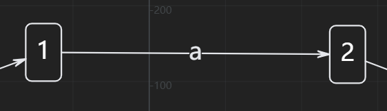
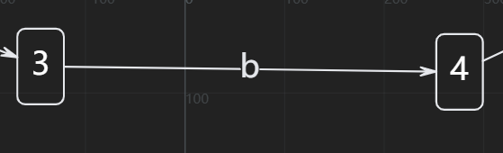
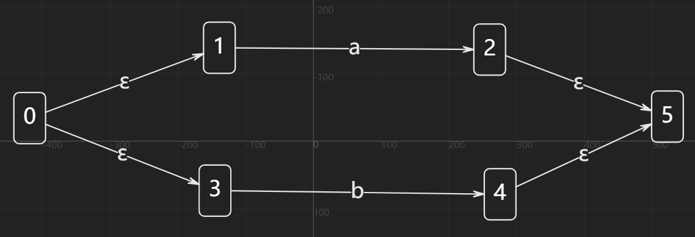
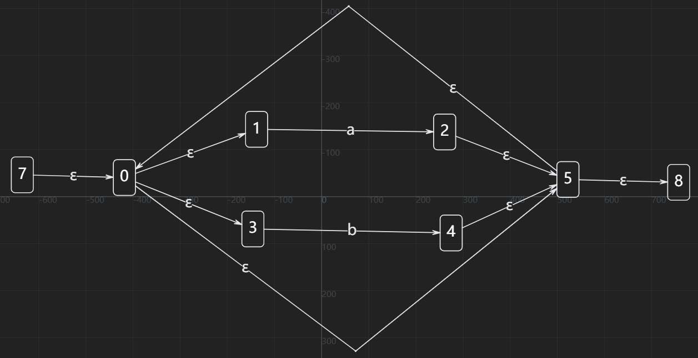
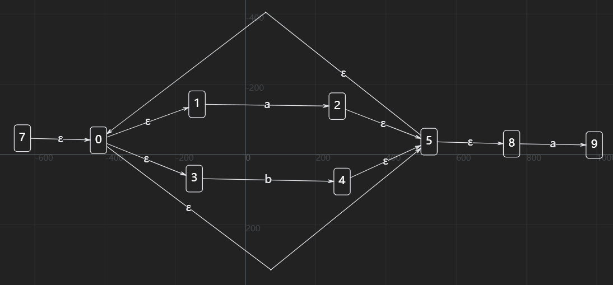
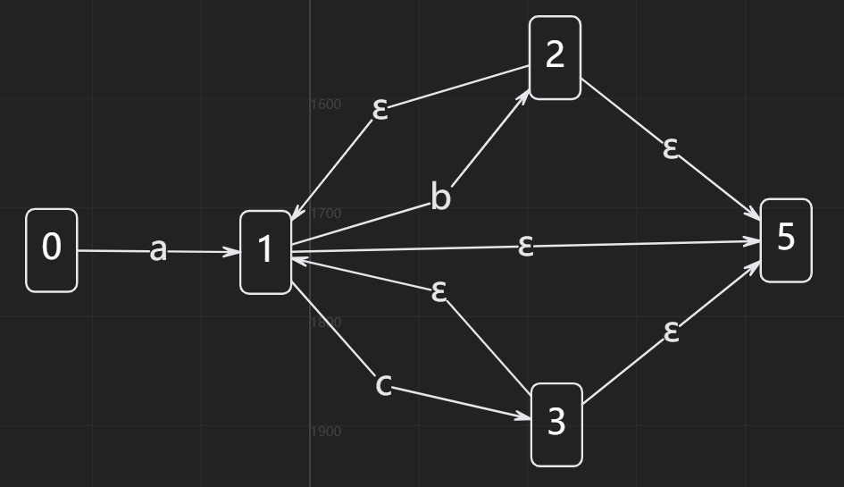

# 词法分析

## 词法分析器的输出形式

二元式

```c
a = 1;
b = 10;
while (a < b) 
    a = a + 1;
b = a + b;
```

    <ID, "a"> <ASSIGN> <INTEGER, 1> <SEMICOLON>
    <ID, "b"> <ASSIGN> <INTEGER, 10> <SEMICOLON> 
    <WHILE> <LPAREN> <ID, "a"> <LESS> <ID, "b"> <RPAREN>
        <ID, "a"> <ASSIGN> <ID, "a"> <PLUS> <INTEGER, 1> <SEMICOLON>
    <ID, "b"> <ASSIGN> <ID, "a"> <PLUS> <ID, "b"> <SEMICOLON>

## 种别码的分配格式

- 关键字：一字一码 (if=1, while=2, ...)
- 标识符：一类一码 (ID=10)
- 常数：按类型分种 (INT=20, FLOAT=21)
- 运算符：一字一码 (PLUS=30, ASSIGN=31)
- 界符：一字一码 (SEMICOLON=40, LPAREN=41)

## 词法分析器的设计

就是一个直观的想法

    状态转换图

    就是 1 ---a---> 2

    1状态，匹配一个a，到2状态

* 手工实现词法分析器的基础

* 理解自动机理论的直观工具

* 调试词法分析问题的可视化手段

## 词法分析器的实现

重点，如何把刚才的想法，用数学的方式表示

---

正则表达式 --**Thompson构造**--> NFA --**子集构造**--> DFA --**最小化**--> 优化DFA --**代码生成**--> 词法分析器

---


### 正则表达式

### 有限自动机

#### 非确定有限自动机（NFA）

    状态转换：NFA允许在某个状态下对同一个输入有多个可能的转换，也可以在没有输入的情况下进行转换（ε-转换，即空转换）。
    灵活性：由于其非确定性，NFA在设计时通常更为简单和直观，因为它可以同时考虑多种可能的状态转换路径。
    计算效率：虽然NFA的设计较为简单，但在实际运行时可能会因为需要探索多条路径而效率较低。

#### 确定性有限自动机（DFA）

    状态转换：DFA对于每一个状态和输入符号，都有唯一确定的下一个状态，不允许ε-转换。
    确定性：DFA的状态转换是确定的，即对于给定的输入，总是会转移到同一个下一状态。
    计算效率：由于其确定性，DFA在实际运行时效率较高，因为它不需要探索多条路径，而是直接根据输入进行状态转换。

### 正则表达式和NFA的等价性

**Thompson构造法:(来个例子)**

### $(a|b)^*a$

* 匹配a



* 匹配b



* a和b是或的关系



* (a|b)*



* (a|b)*a



### NFA和DFA等价性

**子集构造算法：**

### $a(b|c)^*$



NFA:

    状态0(开始状态) --a--> 状态1
    状态1 --b--> 状态2
    状态1 --c--> 状态3
    状态1 --ε--> 状态5
    状态2 --ε--> 状态1
    状态3 --ε--> 状态1
    状态2 --ε--> 状态5
    状态3 --ε--> 状态5(接收状态)

### 子集构造过程

**ε-closure(s)**：从状态s出发，只通过ε边能到达的所有状态  
**move(T, a)**：从状态集合T出发，读入字符a能直接到达的状态

* TA位置出发

    **TA = ε-closure(0) = {0}**  
    move(TA, a) = {1}  
    **TB = ε-closure(1) = {1, 5}**  

* TB位置出发
    
    move(TB, b) = {2}  
    **TC = ε-closure(2) = {1, 2, 5}**  
    move(TB, c) = {3}  
    **TD = ε-closure(3) = {1, 3, 5}**  

* TC位置出发

    move(TC, b) = {2} = TC  
    move(TC, c) = {3} = TD  

* TD位置出发

    move(TD, c) = {3} = TD  
    move(TD, b) = {2} = TC  

#### 构建DFA状态转移表

|DFA状态|NFA状态集合|输入a|输入b|输入c|是否接收|
|-|-|-|-|-|-|
|A|{0}|B|-|-|否
|B|{1, 5}|-|C|D|是
|C|{1, 2, 5}|-|C|D|是
|D|{1, 3, 5}|-|C|D|是

### 最小化DFA

注意到BCD一样的，所以保留一个

|DFA状态|NFA状态集合|输入a|输入b|输入c|是否接收|
|-|-|-|-|-|-|
|A|{0}|B|-|-|否
|B|{1, 5},{1, 2, 5},{1, 3, 5}|-|B|B|是

### 代码实现if-else嵌套就完事了

# 其他部分

错误恢复机制：词法分析器遇到非法字符时该怎么办？

向前看字符：如何区分 = 和 ==？

词法分析器生成器：Lex/Flex 是如何工作的？

** Unicode处理**：现代编程语言如何支持多语言标识符？