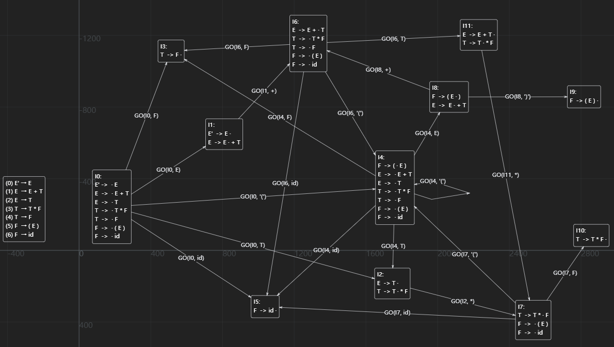

# 自下而上语法分析法

### 文法

```
(0) E' → E
(1) E  → E + T
(2) E  → T
(3) T  → T * F
(4) T  → F
(5) F  → ( E )
(6) F  → id
```

### 状态转移图



根据你提供的JSON数据，我整理了状态闭包和GO表的Markdown格式：

## 状态闭包表

| 状态闭包 | 闭包 |
|-|-|
| I0 | E' -> · E |
| | E -> · E + T |
| | E -> · T |
| | T -> · T * F |
| | T -> · F |
| | F -> · ( E ) |
| | F -> · id |
| I1 | E' -> E · |
| | E -> E · + T |
| I2 | E -> T · |
| | T -> T · * F |
| I3 | T -> F · |
| I4 | F -> ( · E ) |
| | E -> · E + T |
| | E -> · T |
| | T -> · T * F |
| | T -> · F |
| | F -> · ( E ) |
| | F -> · id |
| I5 | F -> id · |
| I6 | E -> E + · T |
| | T -> · T * F |
| | T -> · F |
| | F -> · ( E ) |
| | F -> · id |
| I7 | T -> T * · F |
| | F -> · ( E ) |
| | F -> · id |
| I8 | F -> ( E · ) |
| | E -> E · + T |
| I9 | F -> ( E ) · |
| I10 | T -> T * F · |
| I11 | E -> E + T · |
| | T -> T · * F |

## GO表

| 状态 | GO | E | T | F | ( | ) | + | * | id |
|-|-|-|-|-|-|-|-|-|-|
| I0 | GO | I1 | I2 | I3 | I4 |  |  |  | I5 |
| I1 | GO |  |  |  |  |  | I6 |  |  |
| I2 | GO |  |  |  |  |  |  | I7 |  |
| I3 | GO |  |  |  |  |  |  |  |  |
| I4 | GO | I8 | I2 | I3 | I4 |  |  |  | I5 |
| I5 | GO |  |  |  |  |  |  |  |  |
| I6 | GO |  | I11 | I3 | I4 |  |  |  | I5 |
| I7 | GO |  |  | I10 | I4 |  |  |  | I5 |
| I8 | GO |  |  |  |  | I9 | I6 |  |  |
| I9 | GO |  |  |  |  |  |  |  |  |
| I10 | GO |  |  |  |  |  |  |  |  |
| I11 | GO |  |  |  |  |  |  | I7 |  |

```
(0) E' → E
(1) E  → E + T
(2) E  → T
(3) T  → T * F
(4) T  → F
(5) F  → ( E )
(6) F  → id
```

## FOLLOW表

E' = #

E' -> E

FOLLOW{E} += FOLLOW{E'}

E = E + T

FOLLOW{E} += {+}

FOLLOW{T} += FOLLOW{E}

T = T * F

FOLLOW{T} += {*}

FOLLOW{F} += FOLLOW{T}

F  → ( E )

FOLLOW{E} += {)}

|非终结符| FOLLOW集合 |
|-|-|
|E'| # |
|E| # + ) |
|T| # + * ) |
|F| # + * ) |

## 构造ACTION表

|状态|ACTION  |( | ) | + | * | id | # |
|-|-|-|-|-|-|-|-|
| I0 | ACTION | s4 |  |  | | s5 |
| I1 | ACTION |  |  | s6 |  |  | acc |   
| I2 | ACTION |  | r2 | r2 | s7 |  | r2|
| I3 | ACTION |  |  r4|  r4| r4 |  | r4|
| I4 | ACTION | s4 |  |  | | s5
| I5 | ACTION |  | r6 | r6 | r6 |  | r6|
| I6 | ACTION | s4 |  |  |  | s5 || 
| I7 | ACTION | s4 |  |  |   | s5||
| I8 | ACTION |  | s9 | s6 |  | ||
| I9 | ACTION |  | r5 | r5 |  r5|  | r5 |
| I10 | ACTION |  |  r3|  r3|  r3| | r3| 
| I11 | ACTION |  | r1 |  r1| s7 |  | r1| 

## 构造GOTO表

| 状态 | GOTO | E | T | F | 
|-|-|-|-|-|
| I0 | GO | I1 | I2 | I3 | 
| I1 | GO |  |  |  |  |  | 
| I2 | GO |  |  |  |  |  | 
| I3 | GO |  |  |  |  |  | 
| I4 | GO | I8 | I2 | I3 | 
| I5 | GO |  |  |  |  |  | 
| I6 | GO |  | I11 | I3 |
| I7 | GO |  |  | I10 |
| I8 | GO |  |  |  |  | 
| I9 | GO |  |  |  |  | 
| I10 | GO |  |  |  |  | 
| I11 | GO |  |  |  |  |  

## SLR(1)分析表

```
(0) E' → E
(1) E  → E + T
(2) E  → T
(3) T  → T * F
(4) T  → F
(5) F  → ( E )
(6) F  → id
```

|状态|ACTION|(|)|+|*|id|#|GOTO|E|T|F|
|-|-|-|-|-|-|-|-|-|-|-|-|
| I0 | ACTION | s4 |   |   |   | s5 |   | GOTO | I1 | I2 | I3 |
| I1 | ACTION |   |   | s6 |   |   | acc | GOTO |   |   |   |
| I2 | ACTION |   | r2 | r2 | s7 |   | r2 | GOTO |   |   |   |
| I3 | ACTION |   | r4 | r4 | r4 |   | r4 | GOTO |   |   |   |
| I4 | ACTION | s4 |   |   |   | s5 |   | GOTO | I8 | I2 | I3 |
| I5 | ACTION |   | r6 | r6 | r6 |   | r6 | GOTO |   |   |   |
| I6 | ACTION | s4 |   |   |   | s5 |   | GOTO |   | I11 | I3 |
| I7 | ACTION | s4 |   |   |   | s5 |   | GOTO |   |   | I10 |
| I8 | ACTION |   | s9 | s6 |   |   |   | GOTO |   |   |   |
| I9 | ACTION |   | r5 | r5 | r5 |   | r5 | GOTO |   |   |   |
| I10 | ACTION |   | r3 | r3 | r3 |   | r3 | GOTO |   |   |   |
| I11 | ACTION |   | r1 | r1 | s7 |   | r1 | GOTO |   |   |   |

## 来个例子进行分析

`A + B * C + D`

| 步骤 | 状态栈 | 符号栈 | 输入 | 动作 |说明|
|------|--------|--------|------|------|-|
| 1 | 0 | # | id+id*id+id# | s5 | 移进id和状态5|
| 2 | 0,5 | #id | +id*id+id# | r6 | 用F -> id规约，删除状态5和id，移进F,GOTO(0, F) = 3，压入状态3|
| 3 | 0,3 | #F | +id*id+id# | r4 | 用F->T规约，删除状态3和F，移进T,GOTO(0, T) = 2，压入状态2|
| 4 | 0,2 | #T | +id*id+id# | r2 | 用E -> T规约，删除状态2和T，移进E,GOTO(0, E) = 1，压入状态1|
| 5 | 0,1 | #E | +id*id+id# | s6 | 移进+和状态6|
| 6 | 0,1,6 | #E+ | id*id+id# | s5 | 移进id和状态5|
| 7 | 0,1,6,5 | #E+id | *id+id# | r6 | 用F -> id规约，删除状态5和id，移进F,GOTO(0, F) = 3，压入状态3|
| 8 | 0,1,6,3 | #E+F | *id+id# | r4 | 用F->T规约，删除状态3和F，移进T,GOTO(0, T) = 2，压入状态2|
| 9 | 0,1,6,2 | #E+T | *id+id# | s7 | 移进*和状态7| 
| 10 | 0,1,6,2,7 | #E+T* | id+id# | s5 | 移进id和状态5|
| 11 | 0,1,6,2,7,5 | #E+T*id | +id# | r6 | 用F -> id规约，删除状态5和id，移进F,GOTO(7, F) = 10，压入状态10|
| 12 | 0,1,6,2,7,10 | #E+T*F | +id# | r3 | 用T  → T * F规约，删除状态2,7,10和T*F，移进T,GOTO(6, T) = 11，压入状态11|
| 13 | 0,1,6,11 | #E+T | +id# | r1 | 用E  → E + T规约，删除状态1,6,11和E+T，移进E,GOTO(0, E) = 1，压入状态1|
| 14 | 0,1 | #E | +id# | s6 | 压入+和状态6|
| 15 | 0,1,6 | #E+ | id# | s5 | 压入id和状态5|
| 16 | 0,1,6,5 | #E+id | # | r6 | 用F  → id规约，删除状态5和id，移进F,GOTO(6, F) = 3，压入状态3|
| 17 | 0,1,6,3 | #E+F | # | r4 | 用T  → F规约，删除状态3和F，移进T,GOTO(6, T) = 11，压入状态11|
| 18 | 0,1,6,11 | #E+T | # | r1 | 用E  → E + T规约，删除状态1,6,11和E+T，移进E,GOTO(0, E) = 1，压入状态1|
| 19 | 0,1 | #E | # | acc | 接受|

