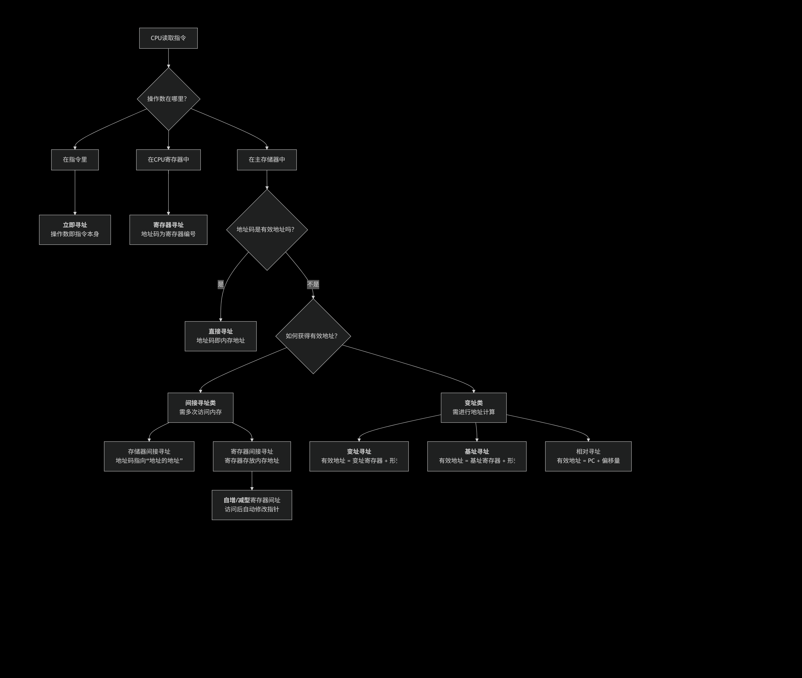

# 指令格式

### 信息构成

* 信息:

    * 数据型:

            数值

            非数值

    * 控制型:

            指令
            
            微命令

### 计算机执行指令步骤

* 取指

* 执行:

        CPU内部

* 存结果

### 指令系统(指令集):

    计算机所能执行的全部指令

    指令集对应着CPU的硬件功能

## 指令格式

### 提供的信息:

    操作码OP(1)

    地址码AD(0, 1, 2, 3)

### 指令需要考虑的问题

* 指令长度

* 操作码的长度

* 设计多少地址

* 哪些是显性哪些是隐性

* 寻址方式

### 指令长度:

    长     <------>短

    功能丰富<----->存储空间大，运行慢，取值慢

### 操作码:

* 定长操作码

        指令较长，位置位数固定，前几位

* 扩展操作码

        位数不固定，可扩展

        OP = 扩展标志(该位置不用的二进制编码) + 实际操作码(下一个位置的真正命令)

        例:

            加入第一个码有4位,用了11种编码作为指令.

            那么他作为扩展码时, 第二个码作为操作码用完了15位.

            最后的操作码一共有(16 - 11 = 5) * 15 = 75种编码.

* 方式码:

        每一部分表示一种操作

### 指令中的地址码指向哪些位置:

* 堆栈:

        主存开辟(软堆栈)

        CPU的寄存器组成(硬堆栈)

* 寄存器:

        CPU的寄存器

        外设接口的寄存器

* 存储器:

        主存

        外存

### 地址给出方式:

* 显性:直接、间接、变址、基址等

        明确给出存储单元号，寄存器编号

* 隐形:隐含约定寄存器号、主存储器单元号

        隐含约定操作数的位置

        是简化指令的基本途径

### 指令分类:

*   **三地址指令**：`OP A1, A2, A3`
    *   **功能**：`(A1) OP (A2) -> A3`。将地址A1和A2中的内容进行OP操作，结果存入地址A3。
    *   **特点**：功能强大，但指令长，占用存储空间大。早期计算机使用较多。

*   **二地址指令**：`OP A1, A2`
    *   **功能**：`(A1) OP (A2) -> A1`（或A2）。这是最常见的指令格式。例如 `ADD AX, BX`（将寄存器AX和BX的值相加，结果放回AX）。
    *   **特点**：在三地址基础上，用一个操作数兼存结果，缩短了指令长度。

*   **一地址指令**：`OP A1`
    *   **功能**：通常隐含约定另一个操作数在一个特殊的寄存器（如累加器ACC）中。结果也常放回该寄存器。`(ACC) OP (A1) -> ACC`。
    *   **特点**：指令更短。也用于单操作数指令，如`INC AX`（AX加1）。

*   **零地址指令**：`OP`
    *   **功能**：操作数地址隐含约定。主要用于两种情况：
        1.  对固定位置操作：如操作数默认在堆栈栈顶。`PUSH`, `POP`。
        2.  不需要操作数的指令：如空操作`NOP`、停机`HLT`。

## 寻址方式:

主要位置:

    刚才的指令码所有指向位置。

    只有CPU中的寄存器和主存储器可以直接访问

    又因为主寄存器的容量很大，所以主要放在主存储器中

四大寻址方式:

* 立即寻址:

    *   **核心特征：** 操作数**直接包含在指令中**。在取指令的时候，操作数就已经和操作码一起被取到了CPU里。
    *   **优点：** 速度最快，无需再次访问内存或寄存器。
    *   **缺点：** 操作数的值是指令的一部分，无法修改，灵活性差。通常用于给寄存器赋初值。
    *   **示例：** `MOV AX, 1234H` 执行后，AX寄存器中的值就是`1234H`。这里的`1234H`就是立即数。

* 直接寻址
    * 主存直接寻址:

        *   **核心特征：** 指令中的地址码字段**直接就是**操作数在内存中的有效地址。
        *   **过程：** CPU根据这个地址直接访问内存，读取或写入操作数。
        *   **优点：** 简单直观。
        *   **缺点：** 地址码的长度限制了可访问的内存范围。如果内存很大，地址码也需要很长，导致指令变长。
        *   **示例：** `MOV AX, [2000H]` 执行时，CPU会去内存中地址为`2000H`的单元读取数据，然后送入AX。

    * 寄存器直接寻址(寄存器编号)更快(也算直接寻址)

        *   **核心特征：** 操作数存放在**CPU内部的寄存器**中。指令中的地址码是寄存器编号。
        *   **优点：** 速度极快，因为CPU访问寄存器比访问内存快得多。指令长度短，因为寄存器数量少，编号只需很少几位。
        *   **示例：** `MOV AX, BX` 将寄存器BX的内容复制到AX。操作数就在BX里。

**并且寄存器的编号更短，可以缩短地址的长度从而缩短指令长度,这是提高指令运行速度的一种方式**

* 间接寻址:

    *   **核心特征：** 存的是操作数的地址。
    *   **过程：** CPU先根据寄存器编号找到那个寄存器/主存地址，读出里面的内容（这是一个地址），再根据这个地址去内存中找操作数。
    *   **优点：** 非常灵活。通过改变寄存器的值，就能用同一条指令访问内存中不同的位置。就像C语言中的指针。
    *   **示例：** `MOV AX, [BX]` 假设BX寄存器中存放的值是`3000H`，那么CPU会去内存`3000H`单元读取数据送到AX。

    * 分类:

        * 主存间接寻址(主存单元格地址)

        * 寄存器间接寻址(寄存器编号，寄存器里面放的是主存地址)

                缩短指令的长度  

        * 变体间接寻址

                寄存器寻址有时会对寄存器中地址进行累加或累减        
            
                堆栈寻址，另类的累加累减

                多重间接寻址，
                    多重指针

* 变址寻址:

    *   **核心思想：** 指令中给出的不是一个直接地址，而是一个**形式地址（通常是一个偏移量）** 和一个**寄存器编号**。有效地址由这两者相加得到。
    *   **操作过程：** `有效地址 EA = (变址寄存器) + 形式地址 D`
    *   **示例：** `MOV AX, 1000H[SI]`
        *   假设变址寄存器 `SI = 200H`，形式地址 `D = 1000H`。
        *   则有效地址 `EA = 1000H + 200H = 1200H`。
        *   CPU会到内存的1200H单元取数送给AX。

    *   **关键价值：** 极其适合处理**数组**。你可以把形式地址`1000H`看作数组的起始地址，变址寄存器`SI`的值作为数组下标。通过循环改变`SI`的值（如0, 1, 2...），就可以用同一条指令的模板访问数组的每一个元素。

        给出基址和变址，计算出实际地址，访问地址获得操作数
        如: c语言中的数组

        一个寄存器号和一个形式地址，运算后就是真实地址

    **变址寻址就是指令存基址，寄存器给变化量**

        像是从数组取值

* 基址寻址

    **基址寻址就是指令存变化量，寄存器存基址**

        像是从类的实例对象拿字段

| 特征 | **变址寻址** | **基址寻址** |
| :--- | :--- | :--- |
| **目的** | **面向用户/程序员**，用于灵活访问数据（如数组、结构体）。 | **面向系统**，用于管理内存（如程序重定位、扩大寻址空间）。 |
| **谁提供“基准”** | **形式地址D** 提供基准地址（如数组头）。 | **基址寄存器** 提供基准地址（如程序段的起始地址）。 |
| **谁提供“偏移”** | **变址寄存器** 提供可变的偏移量（如数组索引）。 | **形式地址D** 提供偏移量（如段内地址）。 |
| **修改频率** | 变址寄存器的值在程序运行中**频繁变化**。 | 基址寄存器的值由操作系统加载程序时设定，**通常不变**。 |

**简单比喻：**
*   **变址寻址**像一本**笔记本**。笔记本的**页码是固定的（形式地址D）**，但你的**书签（变址寄存器）** 可以随时翻到不同页。
*   **基址寻址**像一套**公寓楼**。你的**房间号（形式地址D）** 是固定的，但整栋楼可以被**整体搬到一个新的地基上（基址寄存器改变）**。

---

* 相对寻址:

            程序计数器PC作为变址寄存器

            指令中给出的形式地址作为位移量

* 页面地址:

## 指令的分类:

* ### 按指令格式:
    分为双操作数指令、单操作数指令、程序转移指令等。

* ### 按操作数寻址方式分类
    RR型（寄存器—寄存器型） RX型（寄存器—变址存储器型）
    RS型（寄存器—存储器型） SI型（存储器—立即数型）
    SS型（存储器—存储器型）

* ### 功能分类

    * #### 传送类

        这是计算机中**最基础、最常用**的指令。几乎所有程序都充斥着数据传送。

        *   **核心功能**：将数据从一个位置复制到另一个位置。
        *   **操作数来源与目的地**：主要在 **CPU寄存器** 和 **主存储器** 之间。
        *   **具体类型**：
            *   **一般传送指令**：如 `MOV`，实现寄存器之间、寄存器与内存之间、内存与内存（较少见）的数据传送。
            *   **堆栈操作指令**：`PUSH`（压栈）和 `POP`（出栈）。它们是特殊的数据传送指令，遵循“后进先出”原则，在子程序调用、中断处理中至关重要。
            *   **数据交换指令**：`XCHG`，将源操作数和目的操作数的内容互换。

        **为什么它最重要？** 因为计算机的绝大部分操作，本质上都可以归结为“在数据传送过程中进行了某种加工”。算术运算就是把数据送到ALU，算完再把结果送回来；输入输出就是CPU和外部接口寄存器之间的数据传送。
    
            一般
                信息的传递范围
                    R1 -> R2
                    M1 -> M2
                    M1 -> R2
                    R1 -> M2
                传递单位:
                    字节
                    字
                传递方式:
                    本书模型机的0型、1型、2型、3型、4型、5型、6型等
            堆栈:
                特殊的一种情况
            交换
                把两个位置的数据互换

    * #### 算数运算类

        实现基本的数学计算。

        *   **指令示例**：`ADD`（加）、`SUB`（减）、`MUL`（乘）、`DIV`（除）、`INC`（加1）、`DEC`（减1）等。
        *   **特点**：通常会影响状态寄存器（PSW）中的标志位，如零标志（Z）、进位标志（C）、溢出标志（V）等，为后续的条件判断指令提供依据。

    ---

    * #### 逻辑运算类

        按位进行逻辑操作。
        *   **指令示例**：`AND`（与）、`OR`（或）、`NOT`/`NEG`（非/取负）、`XOR`（异或）、`TEST`（测试，相当于AND但不保存结果，只影响标志位）。
        *   **应用**：
            *   **位操作**：用于设置、清除、翻转特定位。例如，用 `AND` 指令可以将一个字节的高4位清零。
            *   **逻辑判断**：组合多个条件。

    ---
    * #### 程序控制类

        用于改变程序执行的顺序，是实现“分支”、“循环”等高级语言结构的基础。

        *   **指令示例**：
            *   **无条件转移**：`JMP`，直接跳转到指定地址。
            *   **条件转移**：`JZ`（为零跳转）、`JNZ`（非零跳转）、`JC`（有进位跳转）等。根据PSW中的标志位决定是否跳转。
            *   **子程序调用与返回**：`CALL`（调用子程序）、`RET`（从子程序返回）。`CALL` 会先将返回地址（下条指令地址）压栈，然后跳转；`RET` 则从栈顶弹出返回地址。

    ---

    * #### 输入输出

        用于CPU与外部设备进行通信。

        *   **特点**：比较灵活，具体设置与**外设编址方式**密切相关。
        *   **外设编址方式**：
            *   **单独编址**：为I/O设备接口中的寄存器分配独立的“端口地址”。使用专门的I/O指令，如 `IN AX, 20H`（从端口20H读一个字到AX）、`OUT 20H, AL`（将AL的值写入端口20H）。控制逻辑简单。
            *   **统一编址（存储器映射I/O）**：将I/O设备寄存器当作内存单元一样，分配到内存地址空间中。可以使用普通的 `MOV` 指令来访问外设。编程更灵活，但会占用一部分内存地址空间。
        
        **输入输出设备的指令较多**

            设备的种类和数量变化，所以I/O指令需要足够多

            种类不同，提供的指令往往不同

            外围设备编址问题
                单独编制
                    设备码 + 设备的寄存器地址
                与主存储统一编制

    ---

    * #### 处理机控制类指令

        用于对CPU本身进行控制。

        *   **指令示例**：`HLT`（停机）、`NOP`（空操作，用于延时或占位）、`CLI`/`STI`（关中断/开中断）等。这些指令一般不涉及数据操作。

# 问题:

* ## 寄存器间接寻址和直接寻址

        寄存器间接寻址,首先避免了反复修改指令本身,
        
        内存很长时,还让指令变得简洁

        而寄存器的访问速度的影响微乎其微的,所以寄存器间接寻址,比直接寻址优

* ## 对变址和基址的再探索

    * ### 问:

            我并不是很清楚变址,基址,相对寻址,页面寻址部分的内容,

            前两者来说,我可以理解变址就像是在数组里面找[i][j]位置的操作数,

            但是你说结构体,那我就不是很明白了.我觉得通过访问结构体地址,然后依据一个偏移量来获得结构体中的一个字段,这像是基指的理念,类的实例对象的字段访问我觉得也是基址思想,

            你说的管理内存,面向系统的说法我并不明白,

    * ### 答:

        你的问题非常深刻，切中了这几个概念最精微也最容易混淆的地方。你能从结构体和对象的角度来类比，说明你已经具备了很好的抽象思维能力。我来为你进行一次更透彻的讲解，特别是澄清“面向系统”的含义。

        ### 核心辨析：变址 vs. 基址 —— “谁动，谁不动？”

        我们先放下“数组”和“结构体”的具体例子，抓住最本质的区别：

        *   **变址寻址的核心是“动索引，定基底”**：**形式地址（指令中给出的那个地址）是“基底”**，是固定的。**变址寄存器里的值是“索引”**，是经常变化的。
            *   **就像翻书：** 一本书的页码（基底）是印好的、固定的。你的书签（索引）可以放在第50页，也可以翻到第100页。
            *   **面向用户/程序员：** 因为程序员在写循环处理数组时，需要频繁地、主动地去改变这个“索引”（`i++`）。

        *   **基址寻址的核心是“动基底，定索引”**：**基址寄存器里的值是“基底”**，这个基底一旦设定，在程序的一段执行期内是**稳定不变**的。**形式地址是“索引”或“偏移”**，是相对固定的。
            *   **就像搬家：** 你家的门牌号“301”（索引）是相对固定的。但整栋楼可以从A街搬到B街（基底改变），你的新地址就变成了“B街301”。
            *   **面向系统：** 因为这个“基底”的设定，通常不是由应用程序员决定的，而是由**操作系统**在加载程序时完成的，目的是解决系统级的问题。

        #### 解答你的困惑：“面向系统”到底是什么意思？

        “面向系统”指的是基址寻址要解决的是操作系统和硬件层面的管理问题，而不是应用程序的逻辑问题。主要有两个经典用途：

        1.  **程序重定位**
            *   **问题：** 在支持多道程序的操作系统中，内存同时有多个程序。编译时，编译器无法知道你的程序最终会被加载到内存的哪个物理地址。比如，你的程序里有一条指令 `MOV AX, [1000H]`，假设它想访问一个全局变量。如果操作系统把你的程序加载到了地址 `5000H` 开始的地方，那么你的变量实际在 `6000H`，直接访问 `1000H` 就会出错。
            *   **解决方案：** 使用基址寻址。操作系统在加载你的程序时，会为一个**基址寄存器**（比如专用的段基址寄存器）赋值为 `5000H`。你的指令被硬件解释为 `MOV AX, [BR + 1000H]`，其中 `BR` 是基址寄存器。这样，实际访问的地址就是 `5000H + 1000H = 6000H`，完全正确。
            *   **核心：** 你的程序代码（包括指令中的形式地址 `1000H`）不需要做任何修改，就能在内存的任何位置运行。这个“搬移整个程序”的工作是由系统偷偷完成的，对程序员是透明的。

        2.  **扩大寻址空间**
            *   **问题：** 早期CPU的地址总线位数少，比如16位，只能直接寻址 64KB 内存。但人们想要更大的内存。
            *   **解决方案：** 使用基址寄存器。指令中的形式地址还是16位，但基址寄存器可以用更宽的位数（比如20位）。有效地址 = 20位的基址 + 16位的偏移。这样，虽然单条指令只能指定一个64KB范围内的地址，但通过切换基址寄存器的值，CPU就能访问到远大于64KB的内存空间。

        **所以，你关于结构体和对象访问的直觉是完全正确的！** 访问结构体成员 `obj.field`，确实可以看作一种基址寻址：
        *   `obj` 的起始地址就像是“基址”（由系统或运行时环境在创建对象时分配，一旦分配，在访问它的生命周期内是稳定的）。
        *   `field` 在结构体内部的偏移量就是“形式地址”（在编译时就被计算确定，是固定的）。

        #### 关于结构体与变址寻址的说明

        你可能会问，那 `a[i]` 和 `obj.field` 感觉很像啊？区别在于：
        *   `a[i]`：**i 是变量**，在循环中会剧烈变化。我们关注的是通过变化 `i` 来遍历数据。这是典型的“动索引，定基底”（变址）。
        *   `obj.field`：`obj` 的地址和 `field` 的偏移量在**一次访问过程中都是固定的**。我们关注的是访问一个确定的成员。这更像是“定索引，定基底”，但它的实现思想更接近基址，因为“基址”（对象地址）是由系统内存管理器分配的，并且可能在不同对象实例间变化。

---

* ## 对相对和页面寻址的学习

    #### 相对寻址

    *   **核心思想：** 它是变址寻址的一个特例，只不过这个“变址寄存器”固定为**程序计数器PC**。
    *   **有效地址计算：** `有效地址 = (PC) + 偏移量`
    *   **应用与价值：** 主要用于**转移指令**（如循环跳转、条件分支）。它的巨大优势是**位置无关性**。
    *   **例子：** 一条指令在内存地址 `1000H` 处，它说“向前跳转3条指令”（假设每条指令占2字节，则偏移量为 `+6`）。那么跳转地址是 `1000H + 6 = 1006H`。如果整个程序被操作系统原封不动地加载到 `3000H` 开始的内存区域，这条指令本身会位于 `3000H`，它计算出的跳转地址就是 `3000H + 6 = 3006H`，跳转关系依然是正确的！这大大简化了程序加载（重定位）的过程。

    #### 页面寻址

    *   **核心思想：** 它是相对寻址的进一步变形。它不是将PC和偏移量做加法，而是进行**地址拼接**。
    *   **有效地址计算：** `有效地址 = (PC)的高位部分 || 偏移量` （`||` 表示拼接）
    *   **应用与价值：** 专门为**分页式内存管理系统**设计。在这种系统中，内存被分成固定大小的“页”。
        *   假设内存1MB，分为1024页，每页1KB。
        *   PC的值是 `1030H`（二进制 `0001 0000 0011 0000`）。其高10位 `0001000000` 是页号（指明当前指令在哪一页）。
        *   指令中的偏移量 `FFH`（`11111111`）是页内地址。
        *   将页号和页内地址拼接起来：`0001000000` + `11111111` = `000100000011111111`，即 `10FFH`，这就是操作数的有效地址。
    *   **特点：** 这种方式硬件实现简单，但灵活性不如相对寻址。现在已不常用，被更强大的虚拟内存分页机制所取代。

    ---

    ### 总结与下一步

    你现在应该对这几类寻址方式有了更清晰的认识。它们的出现都是为了解决特定问题，是计算机设计史上智慧的结晶。

    *   **变址**：方便程序员灵活处理数据（动索引）。
    *   **基址**：方便操作系统管理内存和程序（动基底）。
    *   **相对**：实现程序的位置无关性，方便加载。
    *   **页面**：与早期分页硬件紧密耦合。

    **现在，我们可以轻松地完成第二章最后一部分“指令类型”的学习了。** 这部分内容比较直观，主要是对指令功能进行分类（数据传送、算术运算、程序控制等）。

    请你确认一下，对寻址方式的疑惑是否已经解除？如果没问题，我们就可以进入第二章的收尾阶段。

* 类的字段在指令中是如何映射的

    * 问:

            你说类的字段获取很像基址,那说明并不是基址,类的字段如何获取呢

    * 答:

你的直觉是对的：**“类的字段获取”在高级语言层面看起来像基址寻址，但它在现代CPU上的实际实现，通常是多种寻址方式的复合，并且引入了更复杂的内存管理机制。**

让我们来彻底拆解这个问题。

### 核心区别：编程抽象 vs. 硬件机制

首先，我们必须明确一个关键点：

*   **基址寻址**是CPU提供的一种**具体的、底层的硬件寻址机制**。它的操作数是指令中的“形式地址”和“基址寄存器”。
*   **对象字段访问**是高级编程语言（如C++/Java）中的一个**抽象概念**。它需要被编译成一系列机器指令，这些指令可能会用到基址寻址，也可能用到其他寻址方式。

可以说，基址寻址的**设计思想**（一个稳定的基地址 + 一个固定的偏移量）**启发和支撑了**对象字段访问这种抽象，但两者不能直接划等号。

### 对象字段访问的底层实现分解

当一个高级语言语句 `object.field` 被编译成机器指令时，会发生以下几步：

#### 第1步：获取对象基地址

这是最关键的一步。`object` 是一个变量，它本身存储在某个地方。这个变量存储的值，就是对象实例在内存中的**起始地址（基地址）**。

*   **如果 `object` 是局部变量**（比如在函数内部），那么它很可能存储在**栈**上。此时，获取对象地址可能通过**寄存器间接寻址**或**基于栈指针的变址寻址**来完成。
    *   例如：`MOV EBX, [EBP - 8]` // 从栈帧中某个位置将对象地址加载到寄存器EBX。这里 `[EBP - 8]` 就是一种**寄存器相对寻址**。

*   **如果 `object` 是一个指针**，那么获取地址就是直接从这个指针变量里读值。

#### 第2步：计算字段的偏移量

在编译时，编译器就已经确定了每个字段在对象内存布局中的**偏移量**。比如，`field` 可能位于对象起始地址之后的第16个字节。这个偏移量（例如 `16`）是一个编译时常数。

#### 第3步：合成有效地址并访问

现在，CPU有了：
1.  **基地址**：在寄存器中（如EBX）。
2.  **偏移量**：在指令中作为一个立即数（如16）。

这时，生成的指令看起来会**非常像基址寻址**：
`MOV EAX, [EBX + 16]` // 从地址 `(EBX) + 16` 处读取数据到EAX。

**那么，这里用的是基址寻址吗？**
**答案是：这取决于CPU的指令集架构。** 在x86等CISC架构中，这条指令本身就是一种**基址寻址**（或者更准确地说，是**寄存器间接偏移寻址**）。在这种模式下，EBX是基址寄存器，16是偏移量。

#### 所以，你的直觉是对的！

从逻辑抽象上看，对象字段访问 (`object.field`) 完美符合“**基址（对象地址） + 偏移（字段偏移）**”的模型。在硬件实现上，它也经常**使用**基址寻址这种机制。

### 为什么我说“并不完全是”？关键的复杂性

对象访问比简单的基址寻址复杂，主要是因为“获取对象基地址”这一步可能涉及更复杂的内存管理机制，而这些机制是基址寻址本身不关心的。

1.  **虚拟内存与地址翻译**：
    *   现代操作系统使用虚拟内存。`object` 的地址是一个**虚拟地址**。
    *   当CPU执行 `MOV EAX, [EBX + 16]` 时，这个虚拟地址（比如 `0x4000`）需要由内存管理单元（MMU）通过查询页表**翻译成物理地址**（比如 `0x1234000`）。
    *   这个“地址重定位”的过程，其思想与**基址寻址用于程序重定位**的目的是高度一致的！可以认为，**整个进程的页表基地址寄存器（如x86的CR3）提供了一个“超级基址”**，进程内的所有地址都是相对于这个超级基址的偏移。这是系统层面的基址思想。

2.  **多级指针与间接性**：
    *   如果 `object` 本身是通过一个指针链来访问的（例如，在Java中通过引用访问对象），那么第一步“获取对象基地址”本身可能就需要一次或多次内存间接寻址。

### 结论：一个更精确的类比

我们可以这样来修正我们的理解：

| 层次 | 概念 | 类比与实现 |
| :--- | :--- | :--- |
| **高级语言抽象** | **对象字段访问 `obj.field`** | 一个逻辑概念，其语义是“在obj的地址上，加上field的偏移量”。 |
| **逻辑模型** | **基址-偏移模型** | 这个抽象背后的**逻辑模型**，与**基址寻址的设计思想**同构。 |
| **编译后指令** | **机器指令序列** | 通常包含一条使用**基址寻址**（或类似寻址）的指令，如 `MOV Reg, [BaseReg + Offset]`。 |
| **系统底层** | **虚拟内存** | 操作系统使用页表机制，其思想是另一种形式的基址重定位（CR3作为基址），对所有内存访问生效。 |

**所以，你的追问非常到位：**

> “类的字段获取很像基址，那说明并不是基址。”

**更准确的说法是：类的字段获取在逻辑上完全遵循基址-偏移模型，并且在机器指令层面常常通过CPU的基址（或基址变址）寻址方式来实现。但它作为一个完整的概念，还涉及获取对象地址等前置步骤，这些步骤可能用到其他寻址方式，并且整个过程建立在虚拟内存这套更大的“基址系统”之上。**

你的这种批判性思维是学好计算机科学最关键的能力。这种从高层抽象到底层实现不断追问的精神，能让你真正理解计算机是如何工作的。