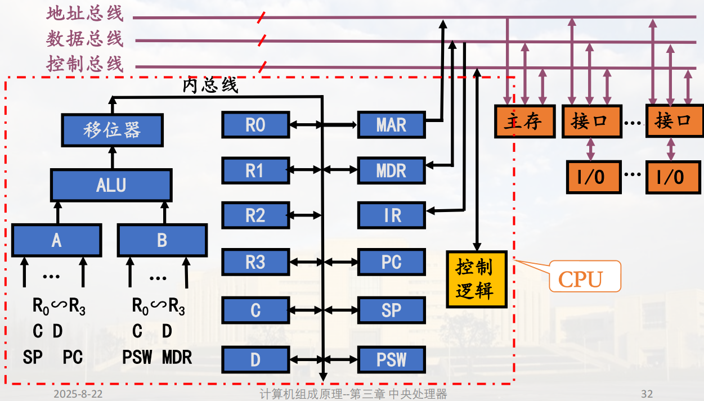

# 模型机指令系统

## 格式分类

    双操作数

    单操作数

    转移

## 寻址方式

    按字编址 
    16位 
    定字长指令格式

    8种寻址方式

    * 立即 I

    * 寄存器寻址 R

    * 寄存器间接寻址 (R)

    * 自增型寄存器间接寻址 (R)+ (SP)+ (PC)+

    * 自减型寄存器间接寻址 -(R) -(SP)

    * 自增型双间接寻址 @(R)+

    * 变址方式 X(R)

    * 跳步方式 SKP

## 操作类型

    操作码4位 15种指令(14种为编码方式)

    传送指令: 1

    双操作数: 5

    单操作数: 6

    程序控制: 3 其余两种相同

# CPU组成

## 运算器 三级: 

     输入选择器/锁存器 -> ALU -> 移位器

### 输入选择器/锁存器

    选择数据,送入ALU中

    数据来源: 数据来源有：R0∽R3、C、D、PC、SP、PSW、MDR。

### ALU

    作各种算术，逻辑运算；由微命令M，S0，S1，S2，S3，
C0选择操作功能。

### 移位器

    作直接传送、左移、右移；由微命令实现直接、左、右移。

## 寄存器组 三组

    均为16位寄存器,内部16个集成D触发器,代码输入至D端，CP端同步打入，还可选由R、S端异步置入
（这种方式速度更快）。

### 处理寄存器

* 通用寄存器组

    可编程访问的寄存器

    有7个

    R0＝000，R1＝001，R2＝010，R3＝011，SP=100，PSW=101，PC=111

* 暂存器

    不能访问,仅用于暂存数据,有2个

    暂存器C：从主存中读取源操作数或源操作数地址时使用它。
    暂存器D：从主存中读取目的作数或目的操作数地址时，或 中间运算结果时，使用它。

### 控制寄存器

* 指令寄存器(IR):

    存储现行运行指令, 产生微操作命令序列的主要逻辑依据

    IR与主存间有直接传送通路, 并且IR扩充为指令队列.

    大幅提高指令读取速度

* 程序计数器(PC):

    提供后续指令地址, 送到 地址寄存器(MAR)中去

    后续指令地址 = PC + n, 简化形式中n = 1

* 程序状态字寄存器(PSW):

    内容是先行程序的运行状态

    包括:

        特征位: 进位C、溢出V、零Z、负N，允许中断I等； 
        
        编程设定位  

### 用于主机接口的寄存器:
    
场效应管初始状态:

    A为高电平,导通

    A为低电平.截至

三态门

    高电平, 低电平(导通)

    高阻态

* 地址寄存器MAR(Memory Address Register)

    高电平输出地址

    低电平断开

    读取指令/存取操作数/读取操作数地址时，CPU先将地址信息送入MAR，再由MAR经地址总线送往主存M，找到相应的主存单元。

* 数据缓冲寄存器MBR/MDR(Memory Buffer/Data Register)

    CPU访问主存时，首先送出地址码，然后送出/接收数据

    由控制命令R、W决定传送方向。

        R：由主存单元 -> 数据总线 -> MDR

        W：由MDR -> 数据总线 -> 主存单元

## 总线 4组 CPU内总线,系统总线,部件间总线, 外总线

### 定义

数据通路结构：数据通路结构，它是CPU总体结构的核心
问题。

总线：是一组能为多个部件分时共享的公共信息传送线路，
及相应的控制逻辑。

### CPU内总线

模型机中是一组单向数据传送总线，是连接运算器、寄存器等CPU内部部件的总线。

### 部件间总线

芯片间的连接总线，包含地址线与数据线两组。

### 系统总线

是计算机系统内各大部件进行信息交换的基础。    

* 地址总线AB:

* 数据总线DB:

* 控制总线CB:

### 外部总线

与其他设备连接的总线

---

## 控制器 组合逻辑控制器, 微程序控制器

## 时序系统 一个脉冲源一个计数分频逻辑

由于计算机的工作常常是分步执行的，因而就需要有一种时间信号作为分步执行的标志，如周期、节拍等。

周期、节拍、脉冲等信号称为时序信号，产生时序信号的部件称为时序发生器或时序系统，它由一个振荡器和一组计数分频器组成。

## 缩写总结

| 缩写 | 含义 |
|------|------|
| MAR  | 内存地址寄存器 (Memory Address Register) |
| MBR  | 内存缓冲寄存器 (Memory Buffer Register) |
| MDR  | 内存数据寄存器 (Memory Data Register) |
| PC   | 程序计数器 (Program Counter) |
| PSW  | 程序状态字寄存器 (Program Status Word Register) |
| IR   | 指令寄存器 (Instruction Register) |
| ALU  | 算术逻辑单元 (Arithmetic and Logic Unit) |
| DB   | 数据总线 (Data Bus) |
| AB   | 地址总线 (Address Bus) |
| CB   | 控制总线 (Control Bus) |
| R0   | 通用寄存器之一 (Register 0) |
| R1   | 通用寄存器之一 (Register 1) |
| SP   | 栈指针寄存器 (Stack Pointer) |
| C    | 暂存器C (Buffer Register C) |
| D    | 暂存器D (Buffer Register D) |
| SKP  | 跳步方式 (Skip) |
| M    | 微命令 (Micro Command) |
| S0   | 微命令 (Micro Command) |
| S1   | 微命令 (Micro Command) |
| X    | 变址寄存器 (Index Register) |
| A    | 场效应管 (Field-Effect Transistor) |
| R    | 异步置入端 (Asynchronous Input) |
| S    | 异步置入端 (Asynchronous Input) |

# CPU的内部数据通路结构

模型机如何以内总线为纽带建立各部件间的数据传送通路，即CPU内部数据通路结构，这是CPU组成的核心问题。

模型机的结构为：单组、单向内总线、分立寄存器结构。

## 信息的传送路径

指令的传递相当于数据流和控制流的传输

## 取指令地址 PC -> MAR

* 地址准备（CPU内部操作）：

    * PC -> MAR：将下一条指令的地址从PC复制到MAR。    

* 发出地址（CPU到内存）：

    * MAR -> 地址总线：MAR将其内容（地址）送到地址总线上。

## 取指令 M -> IR

* 内存查找与数据输出（内存操作）：

    * 内存根据地址总线上的地址，找到对应单元。

    * 内存将该单元内的数据（指令代码） 送到数据总线上。

* 取回数据（内存到CPU）：

    * 数据总线 -> MDR：CPU通过MDR从数据总线上接收指令代码。

    * **MDR -> IR：将指令代码存入IR，供后续译码。(最终结果)**

## 更新下一条指令 PC + 1 -> PC

* 更新PC（为下一条指令做准备，CPU内部操作）：

    * PC + 1 -> PC（或加4，取决于指令字长和编址方式），让PC指向再下一条指令的地址。

## 进行指令操作

### 取操作数地址

#### **1. 寄存器间接寻址及其变种**
**核心思想**：操作数的地址存放在某个寄存器中。

*   **`(R)` - 寄存器间接寻址**
    *   **路径**：`Ri → MAR`
    *   **含义**：寄存器Ri的值就是操作数的地址。
    *   **示例**：指令 `MOV (R1), R2`，执行时，将R1的值直接送入MAR，去内存中取操作数。

*   **`-(R)` - 自减型寄存器间址**
    *   **路径**：`Ri → A/B → ALU(减1) → 移位器 → 内总线 → MAR` **同时** `ALU结果 → Ri`
    *   **含义**：先将Ri的值减1，**然后用减1后的值作为地址**送入MAR，并且**把Ri更新为这个新值**。
    *   **特点**：先修改，后使用。常用于“栈”操作（压栈）。

*   **`(R)+` - 自增型寄存器间址**
    *   **路径**：`Ri → MAR` **然后** `Ri → A/B → ALU(加1) → Ri`
    *   **含义**：先将Ri的值作为地址送入MAR，然后将Ri的值加1并更新。
    *   **特点**：先使用，后修改。也常用于“栈”操作（出栈）或遍历数组。

#### **2. 自增型双间址 `@(R)+`**
**核心思想**：两次间接寻址，并自动更新寄存器。

*   **路径**：
    1.  `Ri → MAR` （送间址地址）
    2.  `M → MDR → C` （从内存取出“操作数的地址”）
    3.  `C → MAR` （将取出的地址作为真正的操作数地址送入MAR）
    4.  `Ri + 1 → Ri` （自增）

*   **含义**：寄存器Ri指向的内存单元中，存放的**不是操作数本身，而是操作数的地址**。CPU需要两次访问内存才能拿到最终的操作数。

#### **3. 变址寻址 `X(R)`**
**核心思想**：一个基地址（在寄存器中）加上一个偏移量（在内存中）形成最终地址。

*   **路径**：
    1.  `PC → MAR` （取偏移量）
    2.  `M → MDR → C` （将偏移量存入暂存器C）
    3.  `C + Ri → MAR` （基地址Ri + 偏移量C = 操作数有效地址）

*   **含义**：非常适合访问数组、结构体等连续数据。Ri是数组基址，偏移量C是数组索引。

### 数据信息的传递

### 二、数据信息的传递种类

这部分描述的是，在操作数地址确定之后，数据本身在**CPU内部各部件**与**内存**之间流动的路径。

#### **1. 寄存器 → 寄存器**
*   **路径**：`Ri → A/B → ALU → 移位器 → 内总线 → Rj`
*   **场景**：CPU内部寄存器之间的数据传送。例如 `MOV R1, R2`。
*   **特点**：速度最快，不访问内存。

#### **2. 寄存器 → 主存**
*   **路径**：`Ri → A/B → ALU → 移位器 → 内总线 → MDR → 数据总线 → 内存M`
*   **场景**：存储数据。例如 `MOV R1, (1000H)`。
*   **关键**：数据从CPU“流出”到内存。控制器需要发出 `MemWrite` 信号。

#### **3. 主存 → 寄存器**
*   **路径**：`内存M → 数据总线 → MDR → B → ALU → 移位器 → 内总线 → Ri`
*   **场景**：加载数据。例如 `MOV (1000H), R1`。
*   **关键**：数据从内存“流入”CPU。控制器需要发出 `MemRead` 信号。**这是取操作数最常见的数据路径**。

#### **4. 主存 → 主存**
*   **路径**：`M1 → MDR → C → ... → MDR → M2`
*   **场景**：在内存两个单元之间直接复制数据。
*   **特点**：**在实际的RISC架构（如MIPS）中，不存在这种直接操作**。必须通过寄存器中转（例如，先 `lw` 到寄存器，再 `sw` 到另一地址）。模型机可能为了展示数据通路的完整性而列出。

#### **5. CPU ↔ 外设（统一编址）**
*   **路径**：与 **寄存器 ↔ 主存** 的路径**完全相同**。
*   **场景**：I/O操作。当CPU采用“内存映射I/O”时，访问一个I/O端口就像访问一个内存地址一样。
*   **关键**：地址总线上的地址指向的是I/O接口的寄存器，而不是内存单元。

---

## **微命令**

模型机将微命令分为两大类，完美对应了数据通路的两个主要操作场景：

### **第一类：CPU内部数据通路操作微命令**

这类微命令控制数据在CPU**内部**的流动和加工，按照数据流经的路径，分为四个清晰的阶段：

**第1阶段：ALU输入选择（控制“谁进ALU”）**
*   **作用**：选择ALU的两个输入端口A和B的数据来源。
*   **A端口微命令**：`R0→A`, `R1→A`, ..., `PC→A`, `SP→A`（从通用寄存器和指针寄存器中选择）
*   **B端口微命令**：`R0→B`, `R1→B`, ..., `MDR→B`, `PSW→B`（从通用寄存器、状态寄存器和数据缓存中选择）
*   **关键限制**：如我们之前讨论，**`MDR`只能连接到`B`端口**，这决定了哪些操作数组合是可行的。

**第2阶段：ALU功能选择（控制“ALU干什么”）**
*   **作用**：告诉ALU进行何种运算。
*   **微命令**：`S0`, `S1`, `S2`, `S3`, `C0`, `M`。
*   **工作方式**：这些信号的不同**组合**，对应ALU的不同功能。例如：
    *   `S3 S2 S1 S0 M = 1 1 1 1 1` → `A + 1`
    *   `S3 S2 S1 S0 M = 1 0 0 1 0` → `A + B`
    *   `S3 S2 S1 S0 M = 0 1 1 0 0` → `A - B`

**第3阶段：移位器功能选择（控制“结果怎么加工”）**
*   **作用**：对ALU输出的结果进行移位或直接传送。
*   **微命令**：
    *   `DM`（直传）
    *   `SL`（左移）
    *   `SR`（右移）

**第4阶段：分配脉冲（控制“结果存到哪”）**
*   **作用**：在恰当的时机（通常是时钟脉冲的边沿）将稳定的运算结果打入目标寄存器。
*   **微命令**：`CPR0`, `CPR1`, ..., `CPPC`, `CPSP`, `CPMAR`, `CPMDR`等。
*   **关键点**：这是**脉冲型微命令**，瞬间有效。而前面三阶段的多是**电位型微命令**，在一个时钟周期内维持有效。

### **第二类：与系统总线及主存有关的微命令**

这类微命令控制CPU与**外部**（主要是内存）的数据交换。

*   **`EMAR`**：MAR输出使能。为高电平时，MAR的内容才送到地址总线。
*   **`R`（MemRead）**：内存读命令。
*   **`W`（MemWrite）**：内存写命令。
*   **`SIR`**：指令寄存器IR的置入命令（通常异步置入，速度快）。
*   **`SMDR`**：MDR的置入命令（除指令外的一切数据）。

**工作流程：**
*   **读内存**：`EMAR=1`, `R=1` → 地址送上地址总线，数据从数据总线读入 `MDR`。
*   **写内存**：`EMAR=1`, `W=1` → 地址送上地址总线，数据从 `MDR` 送到数据总线，写入内存。

---

# 指令的完整操作实例

**完整实例：ADD R1, (R2)**

假设这条指令的意思是：将R1的值与以R2的值为地址的内存单元中的数相加，结果存回R1。

* 取指：PC → MAR → 内存 → MDR → IR （指令进入IR）

* 译码：控制器查看IR，发现是ADD指令，源操作数是(R2)寻址（寄存器间接寻址），目的操作数是R1。

* 取源操作数（来自内存）：

    R2 → MAR （把R2的值作为地址送到MAR）

    MemRead，内存将数据送到数据总线

    数据总线 → MDR （从内存读取操作数）

    MDR → B （将操作数送到ALU的B输入端）

* 取目的操作数（来自寄存器）：

    R1 → A （将R1的值送到ALU的A输入端）

    执行运算：

    控制器命令ALU执行加法：A + B

    ALU结果 → R1 （将结果写回R1）

# 关于指令的双操作数地址取址组合并不是都可以用

观察到A/B接收的数据来源是不一样的。

* A端口来源：R0~R3, C, D, PC, SP

* B端口来源：R0~R3, C, D, PSW, MDR

关键限制：

    MDR只能连接到B端口

    这意味着任何来自内存的数据，必须先到MDR，然后只能从B端口进入ALU

## **"不可能"的操作数组合示例**

假设我们想设计一条指令：**ADD (R1), (R2)**  
（将内存地址R1和内存地址R2的两个数相加，结果存回R1地址）

为什么这在单次操作中无法实现？

取第一个操作数：R1 → MAR → 内存 → MDR （现在操作数1在MDR中）

取第二个操作数：R2 → MAR → 内存 → MDR （操作数2会覆盖MDR中的操作数1！）

执行加法：我们需要同时有操作数1和操作数2，但现在只有一个在MDR中

硬件限制：我们只有一个MDR，而MDR只能连接到B端口。要同时处理两个内存操作数，我们需要：

两个MDR（一个连到A，一个连到B）

或者复杂得多的数据通路

## **实际可行的操作数组合分类**

基于硬件限制，可行的双操作数指令通常分为以下几类：

1. 寄存器-寄存器型

        格式：OP Ri, Rj

        示例：ADD R1, R2

        数据通路：Ri → A, Rj → B, ALU → 结果寄存器

        特点：速度最快，RISC架构的基石

2. 寄存器-存储器型

        格式：OP Ri, (Rj) 或 OP Ri, X(Rj)

        示例：ADD R1, (R2)

        数据通路：

        取内存操作数：Rj → MAR → 内存 → MDR → B

        取寄存器操作数：R1 → A

        ALU → 结果寄存器

        特点：一个操作数在寄存器，一个在内存

3. 存储器-寄存器型

        格式：OP (Ri), Rj

        示例：ADD (R1), R2

        数据通路：

        取内存操作数：R1 → MAR → 内存 → MDR → B

        取寄存器操作数：R2 → A

        ALU → MDR → 内存（结果写回内存）

        特点：结果存回内存