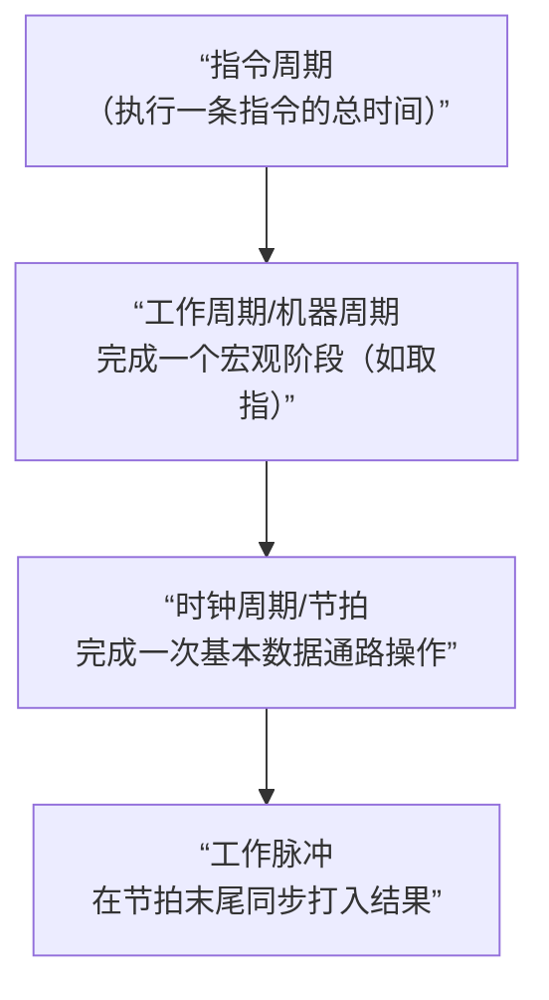
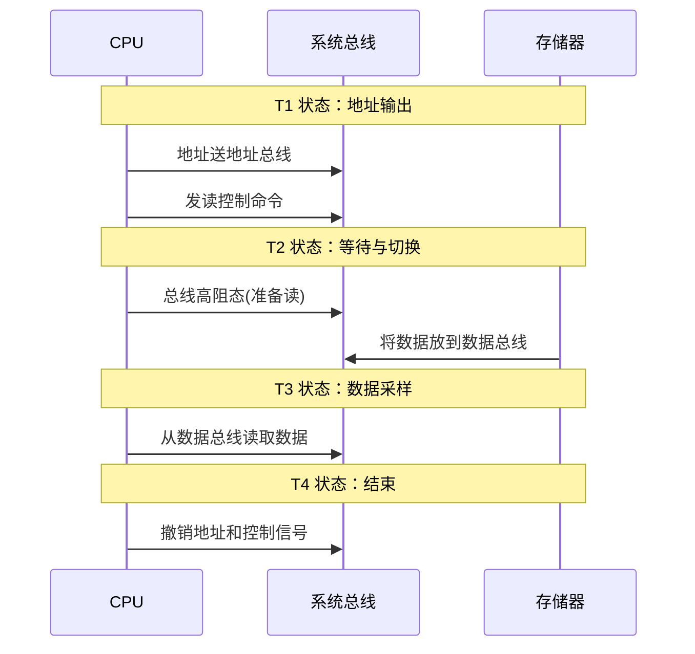

好的！时序系统是CPU的“节拍器”和“指挥棒”，它确保了所有复杂的操作能够像一场优雅的交响乐一样，井然有序地进行。下面我们来系统性地讲解这部分核心知识。

### **时序系统部分知识总结**

#### **一、核心问题：为什么需要时序系统？**

想象一下，如果没有统一的 timing，CPU 的各个部件会乱成一团：
*   寄存器可能在该接收数据的时候没接收，不该接收的时候反而接收了。
*   ALU的结果还没稳定，就被送入下一个部件。
*   对内存的读写可能发生冲突。

**时序系统就是为了解决“什么时候，做什么事”的问题**，它为所有操作提供统一的时间基准和同步信号。

---

### **二、模型机的三级时序系统**

模型机（组合逻辑控制器）采用经典的**三级时序**，从上到下，时间粒度越来越细：



#### **1. 工作周期 - 宏观阶段**

这是最长的时间段，表示CPU处于某个大的工作阶段。模型机设置了**6种工作周期**，用触发器标志：

*   **FT**：取指周期。**所有指令的第一个周期**，完成`M→IR, PC+1`。
*   **ST**：源周期。如果需要从内存读取**源操作数**，则进入ST。
*   **DT**：目的周期。如果需要从内存读取**目的操作数**，则进入DT。
*   **ET**：执行周期。**所有指令的最后一个周期**，完成核心运算（如ALU操作）。
*   **IT**：中断周期。响应外部中断请求。
*   **DMAT**：DMA周期。响应DMA请求，CPU交出总线控制权。

**关键点**：某一时刻只有一个工作周期为1，这为控制器在该阶段发出何种微命令提供了**时间标志**。

#### **2. 时钟周期 - 基本步骤**

也叫**节拍**，它是完成**一次基本数据通路操作**所需的时间（如一次寄存器间数据传送、一次ALU运算）。模型机以**访问一次主存的时间**作为一个时钟周期的宽度。

*   在一个工作周期（如ST）内，可能需要多个节拍（如ST₀, ST₁, ST₂...）才能完成所有微操作。
*   节拍由**节拍计数器**产生，并通过译码器生成对应的时序信号（如T₀, T₁, T₂...）。

#### **3. 工作脉冲 - 同步定时**

*   这是**最短**的时序信号，出现在一个**时钟周期的末尾**。
*   **核心作用**：作为**打入寄存器的同步脉冲**（如`CPPC`, `CPIR`）。
*   **工作方式**：
    *   **脉冲前沿**：将稳定的运算结果**打入**目标寄存器。
    *   **脉冲后沿**：进行**时序转换**（节拍计数器+1，或工作周期切换）。

---

### **三、时序信号与微命令的配合**

这是理解控制器如何工作的关键。微命令分为两大类，它们与时序信号的关系不同：

#### **1. 电位型微命令**

*   **特点**：在一个**时钟周期内有效并保持**。
*   **作用**：建立数据通路，控制数据流向。如 `Ri→A`, `MDR→B`, `ALU=ADD`。
*   **与时序关系**：在节拍开始时建立，并在整个节拍内维持。

**例如，在ST₀节拍：**
*   电位型命令 `R1→A/B`, `DM` 在T₀开始时就有效，打开了从R1到ALU再到内总线的数据通路。
*   数据在总线上逐渐稳定。

#### **2. 脉冲型微命令**

*   **特点**：**短暂脉冲**，通常与工作脉冲同步。
*   **作用**：将已稳定的数据**打入**寄存器。如 `CPMAR`, `CPPC`。
*   **与时序关系**：在节拍**末尾**、工作脉冲的**上升沿**时刻有效。

**接着上面的例子：**
*   在T₀节拍的末尾，工作脉冲P的前沿到来。
*   此时发出脉冲型命令 `CPMAR`，将已经在内部总线上稳定了的（来自R1的）地址数据，打入MAR寄存器。

---

### **四、一个完整的时序周期示例**

以**取指周期FT**的一个节拍为例：

1.  **节拍开始**：
    *   电位型微命令建立：`PC→A`, `A+1`, `DM` （建立PC增量通路）
    *   电位型微命令建立：`EMAR`, `R`, `SIR` （建立读指令通路）

2.  **节拍期间**：
    *   数据在通路上流动并稳定：ALU计算`PC+1`，结果稳定在内部总线上；内存读取指令，数据稳定在数据总线上。

3.  **节拍末尾（工作脉冲P到来）**：
    *   **脉冲前沿**：
        *   `CPPC` 脉冲有效，将`PC+1`的结果打入PC。
        *   `CPIR` 脉冲有效，将数据总线上的指令代码打入IR。
    *   **脉冲后沿**：
        *   时序系统判断FT尚未结束，于是节拍计数器`T+1`，进入下一个节拍（如FT₁），或者判断FT结束，清零节拍计数器，并设置`1→ST`，进入源周期。

### **总结**

时序系统是CPU的**心跳和节奏**：
*   **工作周期** 定义了**做什么阶段的事**（如在取指阶段就发出取指相关的微命令）。
*   **时钟周期** 定义了**每一步操作的时间段**（保证数据通路操作有足够时间完成）。
*   **工作脉冲** 定义了**何时锁存结果**（确保在数据稳定后才存入寄存器，避免竞争和冒险）。

正是这套精密的时序机制，确保了CPU即使在上亿个晶体管、每秒数十亿次的操作下，依然能准确无误地执行程序。理解了时序，你就理解了计算机为何能如此精确和可靠。

---
---
```

```
---
---

# 什么是总线周期

非常好的问题！“总线周期”是一个至关重要的概念，它连接了我们刚才讨论的CPU内部时序和CPU外部的系统总线操作。

### **总线周期详解**

简单来说：**总线周期是CPU通过系统总线与外部（主要是内存或I/O设备）完成一次完整的数据交换所需的时间。** 它是**工作周期**在系统总线上的具体体现。

---

### **一、核心关系：总线周期 vs. 时序系统**

我们可以这样理解它们的层次关系：

*   **时序系统**：是CPU内部的**总体工作时间标准**。
*   **总线周期**：是当时序系统进入某个需要访问外部的工作周期（如FT、ST、DT）时，在**系统总线上展开的一系列具体操作**。

**举个例子：**
当CPU内部时序处于 **取指周期** 时，它在系统总线上就必须执行一个 **“存储器读总线周期”** 来把指令取回来。

---

### **二、一个典型的总线周期（以存储器读为例）**

一个基本的总线周期通常由4个标准的**时钟周期（T状态）** 组成，分别是 **T₁, T₂, T₃, T₄**。下图清晰地展示了这个流程：



下面我们来详细解释图中的每一个阶段：

*   **T₁ 状态**：
    *   CPU将**内存地址**送到**地址总线**上。
    *   同时，CPU发出**读控制命令**（如 `MEMR` 信号变为低电平），告诉内存：“我要读数据了”。

*   **T₂ 状态**：
    *   CPU将**数据总线**置为**高阻态**（相当于断开连接），从“输出模式”切换为“输入模式”，**准备接收**来自内存的数据。
    *   内存芯片经过地址译码和访问延迟，将指定单元的数据放到**数据总线**上。

*   **T₃ 状态**：
    *   这是关键的 **“数据采样”** 状态。CPU在T₃状态的末尾（通常是时钟下降沿），**读取数据总线**上的稳定数据，并将其存入内部的MDR。

*   **T₄ 状态**：
    *   CPU**撤销**地址总线上的地址和读控制命令。
    *   本次总线周期结束。

---

### **三、总线周期与时钟周期**

*   **时钟周期**是CPU内部操作的基本时间单位。
*   **总线周期**是CPU完成一次总线操作的时间，它由**多个时钟周期**构成。
*   **关系**：`总线周期 = n × 时钟周期` （在早期的8086CPU中，一个基本总线周期通常就是4个时钟周期）。

---

### **四、等待状态**

在上面的理想情况中，CPU假设内存速度足够快，能在T₂结束时提供数据。但如果内存速度较慢，在T₃状态开始时数据还没准备好怎么办？

这时，内存会通过一个专门的信号线（如 `READY`）通知CPU：“数据还没好！”

CPU检测到 `READY` 信号无效，就会在T₃之后**自动插入一个或多个额外的时钟周期**，称为 **Tw（等待状态）**。

*   CPU在每个Tw的开始都检查 `READY` 信号。
*   一旦 `READY` 有效，CPU就退出等待，进入T₄状态。
*   **插入Tw保证了CPU能与不同速度的内存协同工作**，这是总线周期一个非常重要的特性。

---

### **总结**

*   **总线周期**是**功能概念**：描述一次完整的外部数据交换。
*   **时钟周期**是**时间单位**：构成总线周期的基本时间片。
*   **总线周期是“工作周期”在系统总线上的具体实现**。当CPU内部的时序处于FT、ST、DT等需要访存的工作周期时，就必然伴随着一个或多个总线周期。
*   通过插入**等待状态Tw**，总线周期可以灵活地适应不同速度的外部设备。

所以，当你再看到“总线周期”时，就可以清晰地把它定位到我们整个CPU时序框架中：它是CPU内部时序指挥下，与外部世界进行沟通的“外交活动周期”。

---
---
```

```
---
---

# 总线周期和工作周期/时钟周期什么关系

不，不能这样理解。这是一个非常常见的理解误区。恰恰相反，**绝大多数的工作周期和时钟周期，CPU都在进行内部操作，而不进行总线周期。**

你的问题非常好，让我们来彻底澄清这个关键区别。

### 核心结论：总线周期只是“对外业务”，内部操作才是“日常工作”

我们可以用一个高效的办公室工作流程来类比：

*   **CPU内部数据通路** = 办公室内部
*   **系统总线** = 办公室对外的电话线和快递通道
*   **总线周期** = 打电话或收发快递

---

### 详细辨析：什么时候进行总线周期？

只有在需要从**办公室外部**（内存或I/O设备）**获取或发送信息**时，才需要启动总线周期。

**1. 进行总线周期的情况：**

这通常只发生在特定**工作周期**的某些**时钟周期**里。

*   **取指周期**：**必定**包含一个**存储器读总线周期**，用于从内存读取指令。
*   **源周期**：如果源操作数在内存中（非寄存器寻址），则包含一个**存储器读总线周期**。
*   **目的周期**：如果目的操作数在内存中，且需要读取（如双操作数指令），则包含一个**存储器读总线周期**。
*   **执行周期**：如果指令需要将结果写回内存（如 `MOV (R1), R2`），则包含一个**存储器写总线周期**。

**2. 不进行总线周期的情况：**

大量的CPU操作是**纯粹的内部操作**，此时系统总线是空闲的，或者处于高阻态。

*   **寄存器之间的操作**：
    *   `MOV R1, R2` （`R1 → A/B → ALU → 移位器 → 内总线 → R2`）
    *   `ADD R1, R2` （`R1 → A`, `R2 → B`, `ALU运算`, `结果 → R1`）
    *   **所有这些微操作都在CPU内部完成，不占用系统总线。**

*   **ALU运算**：
    *   任何只在寄存器间的算术/逻辑运算。

*   **地址计算**：
    *   例如在变址寻址 `X(R1)` 中，计算有效地址 `(PC) + (R1)` 是在ALU内部完成的，这个计算过程不涉及总线周期。

*   **程序控制**：
    *   条件码的测试和判断。
    *   转移地址的计算。

---

### 总结与类比

| 场景 | CPU在做什么 | 是否进行总线周期 | 类比 |
| :--- | :--- | :--- | :--- |
| **取指** | 从内存读指令 | **是** | 打电话给仓库，要求把“施工图纸”（指令）送过来 |
| **取操作数** | 从内存读数据 | **是** | 打电话给仓库，要求把“原材料”（操作数）送过来 |
| **存结果** | 向内存写数据 | **是** | 打电话叫快递，把“成品”（结果）发出去 |
| **寄存器运算** | R1 + R2 → R1 | **否** | 在办公室内部的工作台上加工零件，与外界无关 |
| **地址计算** | PC + 1 → PC | **否** | 在内部记事本上计算下一个地址，与外界无关 |
| **译码** | 分析指令 | **否** | 阅读和理解施工图纸，是内部思维活动 |

**所以，正确的理解是：**

> **总线周期只是穿插在工作周期和时钟周期中的“特殊事件”。** 当一个工作周期（如FT、ST）需要访问内存时，它才会在其内部的某一个或几个时钟周期里，启动一个总线周期。除此之外，CPU都在高效地执行内部操作。

这个理解也解释了为什么提高CPU缓存命中率如此重要——缓存能让数据直接从CPU内部获取，避免了缓慢的总线周期，从而极大提升了效率。