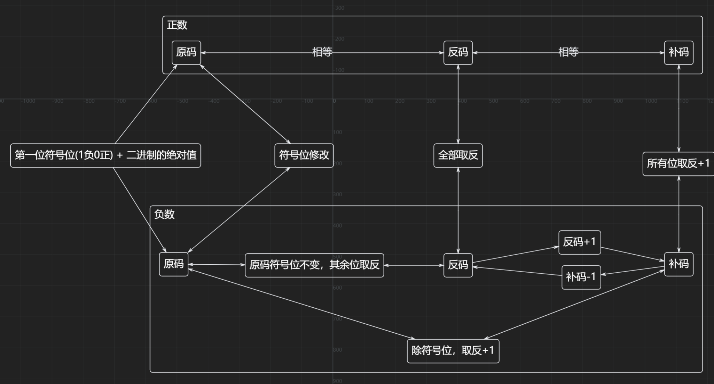

好的！我们一起来学习这份《计算机组成原理》第三章中关于**运算方法**的内容。这部分是计算机底层如何执行加减乘除等基本算术运算的核心知识，非常重要。

我会帮你梳理重点、解释难点，并用更易懂的方式讲解这些概念。

---


先来看看正负数的原反补码



## 📘 本章核心：**定点数的运算方法**

> **目标**：理解计算机是如何通过硬件电路实现加、减、乘、除四则运算的。
>
> **关键词**：补码、原码、符号位、部分积、余数、移位、控制逻辑

---

# 一、定点加减运算（最基础）

### ✅ 核心思想
- 所有操作数都使用**补码**表示（包括正负数）。
- 运算时**连同符号位一起参与计算**。
- 结果也是补码形式。
- 统一用“加法”来完成加和减（减法转为加负数）。

---

### 🔢 两个基本公式（必须记住）

| 公式 | 含义 |
|------|------|
| `(X + Y)补 = X补 + Y补` | 加法：直接把两个补码相加即可 |
| `(X - Y)补 = X补 + (-Y)补` | 减法：变成 `X补` 加上 `Y补` 的相反数 |

📌 **关键点**：
- `(-Y)补` 叫做 **机器负数**，可以通过对 `Y补` **整体取反再加1** 得到（也就是“变补”或“求补”操作）。

---

### 🧠 补码加减规则总结：

1. 操作数用补码表示，符号位参与运算。
2. 加法：两数直接相加。
3. 减法：先对减数 `Y补` 求补（即得 `-Y补`），然后与被减数相加。

✅ **优点**：统一了加减法硬件设计，只需要一个加法器！

---

### 💡 举例说明（书上例题简化版）

假设我们要计算：`X = 5, Y = 3`，在4位系统中（含1位符号位）

- `X补 = 0101`
- `Y补 = 0011`
- `(-Y)补 = 1101`

👉 计算 `X - Y = 5 - 3 = 2`

```
    0101   (X补)
+   1101   ((-Y)补)
----------
   10010   → 取低4位：0010（=2）
```

结果是 `0010`，即 `+2`，正确！

---

# 二、定点乘法运算

手工乘法的问题：
- 要做多次部分积相加
- 每次要左移一位
- 符号怎么处理？

➡️ 计算机解决方案：
- 使用**累加 + 移位**的方法
- 分成两种主流方式：**原码一位乘法** 和 **补码一位乘法**

---

## （1）原码一位乘法 ✅ 推荐先掌握这个

### 🎯 特点：
- 数值部分用绝对值进行运算
- **符号位单独处理**：`正 × 正 = 正`，`负 × 负 = 正`，其余为负

### 🧩 寄存器分配（A, B, C）

| 寄存器 | 用途 | 初始值 |
|--------|------|--------|
| A | 存放**部分积累加和** | 00.0000（双符号位） |
| B | 存放**被乘数的绝对值** | |X|（不变） |
| C | 存放**乘数的绝对值** | |Y|（末位判断后右移） |

### 🔄 运算步骤（n位小数需n步）

每一步看乘数C的**最低位 Cn**：

| Cn 值 | 操作 |
|-------|------|
| 1     | `A = A + B`，然后整体右移一位（A末位移到C高位） |
| 0     | `A = A + 0`（相当于只右移），然后整体右移一位 |

> ⚠️ 右移是**带符号右移**，高位补0（因为都是正数绝对值）

### 📌 举个例子（书中例题）
`X = 0.1101`, `Y = -0.1011` → 求 `XY`

1. 符号：正 × 负 = 负
2. 绝对值相乘：`0.1101 × 0.1011`
3. A=00.0000, B=00.1101, C=.1011

| 步骤 | Cn | 操作 | A | C |
|------|----|------|----|----|
| 初始 | - | - | 00.0000 | .1011 |
| 1 | 1 | A+B → 右移 | 00.0110 | 1.101 |
| 2 | 1 | A+B → 右移 | 00.1001 | 11.10 |
| 3 | 0 | A+0 → 右移 | 00.0100 | 111.1 |
| 4 | 1 | A+B → 右移 | 00.1000 | 1111 |

✅ 最终 A.C = `0.10001111`，加上符号位 → `1.10001111`（负数补码）

---

## （2）补码一位乘法（Booth算法思想）

### 🎯 特点：
- 所有数（含符号位）都用补码参与运算
- 不需要单独处理符号
- 使用**两位判断法**：看当前位和下一位 `(Yn, Yn+1)`

### 🧩 新增寄存器设置

- A: 部分积，初始为 `00.0000`
- B: `X补`
- C: `Y补`，但要在末尾**增加一个附加位 Yn+1 = 0**

### 🔍 判断规则（看最后两位 Cn 和 Cn+1）

| Cn Cn+1 | 操作 |
|---------|------|
| 00 或 11 | A + 0 → 右移 |
| 01      | A + X补 → 右移 |
| 10      | A + (-X补) → 右移 |

> ⚠️ 右移是**补码右移**：符号位不变，低位移出到C，高位补符号位。

### 📌 举个例子（书中例题）
`X = -0.1101`, `Y = -0.1011` → 求 `[XY]补`

- `X补 = 11.0011`
- `(-X)补 = 00.1101`
- `Y补 = 1.0101`，附加位=0 → C = 1.01010

| 步骤 | Cn Cn+1 | 操作 | A | C |
|------|----------|------|-----|-----|
| 初始 | - | - | 00.0000 | 1.01010 |
| 1 | 10 | A + (-X补) → 右移 | 00.0110 | 11.0101 |
| 2 | 01 | A + X补 → 右移 | 11.1100 | 111.010 |
| 3 | 10 | A + (-X补) → 右移 | 00.0100 | 1111.01 |
| 4 | 01 | A + X补 → 右移 | 11.1011 | 11111.0 |
| 5 | 10 | A + (-X补) → 右移 | 00.1000 | ? |

最终 `[XY]补 = 0.10001111` → 真值为正 `0.10001111`

---

### ✅ 对比总结：原码 vs 补码乘法

| 项目 | 原码一位乘 | 补码一位乘 |
|------|------------|-------------|
| 数表示 | 绝对值 | 补码 |
| 符号处理 | 单独处理 | 自动处理 |
| 判断依据 | 乘数末位 Cn | 末两位 Cn Cn+1 |
| 移位方式 | 逻辑右移（补0） | 算术右移（补符号） |
| 步数 | n | n+1 |
| 复杂度 | 简单直观 | 更复杂但集成度高 |

---

# 三、定点除法运算

目标：实现 `X ÷ Y = Q ... R`

问题：
- 如何判断“够不够减”？
- 商怎么生成？
- 符号怎么处理？

主流方法：**不恢复余数法（加减交替法）**

---

## （1）原码不恢复余数除法

### 🎯 特点：
- 被除数、除数取绝对值
- 符号单独处理：同号商正，异号商负

### 🧩 寄存器设置

| 寄存器 | 用途 | 初始值 |
|--------|------|--------|
| A | 存放被除数/余数 | \|X\|（双符号位） |
| B | 存放除数 | \|Y\|（双符号位） |
| C | 存放商 | 0.000...（单符号位） |

### 🔁 运算流程

1. 第一步：`A = 2*A - B`（即 `2r0 - Y`）
2. 根据 A 的符号位判断：
   - 若 A ≥ 0（够减）→ 上商 `1`，下一步做 `2ri - Y`
   - 若 A < 0（不够减）→ 上商 `0`，下一步做 `2ri + Y`
3. 每次左移一位（相当于×2），并在C的末位写入商。
4. 最后一步如果余数为负，需要**恢复余数**：`r + Y`

### 📌 举例（书中例题）
`X = -0.10110`, `Y = 0.11111` → 求商和余数

- A = 00.10110, B = 00.11111, -B = 11.00001

| 步骤 | 条件 | 操作 | A | C |
|------|------|------|-----|-----|
| 1 | - | ←, -B | 00.00001 | 0.00001 |
| 2 | A≥0 | ←, -B | 11.11011 | 0.00010 |
| 3 | A<0 | ←, +B | 00.10101 | 0.00101 |
| 4 | A≥0 | ←, -B | 00.01011 | 0.01011 |
| 5 | A≥0 | ←, -B | 11.10111 | 0.10110 |
| 6 | A<0 | +B（恢复） | 00.10110 | 0.10110 |

✅ 商 = -0.10110（符号异号），余数 = `0.10110 × 2⁻⁵`

---

## （2）补码不恢复余数除法

### 🎯 特点：
- 所有数用补码表示
- 符号自动参与运算
- 引入“假商”概念，最后校正

### 🔁 关键规则

1. 先比较 `X补` 和 `Y补` 是否同号：
   - 同号 → 第一步做 `2X补 - Y补`
   - 异号 → 第一步做 `2X补 + Y补`
2. 后续根据余数 `ri补` 和 `Y补` 的符号决定操作：
   - 同号 → 上商1，做 `2ri - Y`
   - 异号 → 上商0，做 `2ri + Y`
3. 最后对商进行校正（如加1）

---

# 🧭 学习建议与总结

| 方法 | 核心思想 | 关键操作 | 适合初学者？ |
|------|----------|----------|--------------|
| **补码加减** | 统一用加法 | 求补变减为加 | ✅ 是 |
| **原码乘法** | 绝对值相乘，符号独立 | 看乘数末位，加B或0，右移 | ✅ 是 |
| **补码乘法** | Boooth算法思想 | 看两位，三种情况，算术右移 | ❌ 较难 |
| **原码除法** | 绝对值相除，符号独立 | 左移+加减交替，余数判正负 | ✅ 是 |
| **补码除法** | 全程补码运算 | 假商+校正，符号自动处理 | ❌ 难 |

---

# ✅ 掌握路径推荐：

1. **先搞懂补码加减法** → 明白为什么能统一加法器
2. **动手练习原码一位乘法** → 画表格，一步步走
3. **再学原码不恢复余数除法** → 理解“加减交替”
4. 最后再挑战补码乘除法

---

# 📝 小练习（自测）

尝试计算：
- `X = 0.1010`, `Y = 0.1101`，用**原码一位乘法**求 `XY`
- `X = 0.1110`, `Y = 0.1011`，用**原码不恢复余数法**求商（保留4位商）

你可以试着列个表，我随时可以帮你批改！

---

如果你有任何地方不明白，比如某个步骤为什么这么移位、为什么补0、为什么上商1，都可以问我，我会用更生活化的比喻来解释 😊


例子

## 3 + 5 = 8

- 3 = 0011
- 5 = 0101
- 8 = 1000

```
   0011
+  0101  
----------  
   1000
```

结果是 1000，即 8。

## 3 - 7 = -4 -> 3 + (-7) = -4

- 3 = 0011 -> [3]补 = 0011
- 7 = 0111 -> [-7]补 = 1000(7取反) + 1 = 1001
- -4 = 1100

```
   0011
+  1001  
----------  
   1100
```


## 28 - 77 = -49(全用补码计算)

| 数   | 原码    | 补码        |
|------|---------|-------------|
| 28   | 0001-1100 | 0001-1100   |
| 77   | 0100-1101 | 0100-1101   |
| -77  | 1100-1101 | 1011-0011   |
| -49  | 1011-0001 | 1100-1111   |

[28]补 + [-77]补 = [-49]补

```
    0001-1100
+   1011-0011
--------------
    1100-1111
```

所以存储28和77的补码值，
减法需计算-77的补码值，
相加得-49的补码值

## 25 * -3 = -75

8位编码

`25`-> 0001 1001  

`3 `-> 0000 0011  

### 原码乘法

A = 0000 0000  
B = 0001 1001  
C = 0000 0011  

| 步骤 | Cn | 操作 | A | C |
|------|----|------|----|----|
| 初始 | - | - | 0000 0000 | 0000 0011 |
| 1 | 1 | A+B | 0001 1001 | 0000 0011 |
|   | | 右移 | 0000 1100 | 1000 0001 |
| 2 | 1 | A+B| 0010 0101  |  1000 0001 |
|   |  | 右移| 0001 0010  | 1100 0000 |
| 3 | 0 | A+0| 0001 0010 | 1100 0000 |
|  |  | 右移 | 0000 1001 | 0110 0000 |
| 4 | 0 | A+0| 0000 1001 | 0110 0000 |
|  |  | 右移 | 0000 0100 | 1011 0000 |
| 5 | 0 | A+0 | 0000 0100 | 1011 0000 |
|  |  | 右移 | 0000 0010 | 0101 1000 |
| 6 | 0 | A+0 | 0000 0010 | 0101 1000 |
|  |  | 右移 | 0000 0001 | 0010 1100 |
| 7 | 0 | A+0 | 0000 0001 | 0010 1100 |
|  |  | 右移 | 0000 0000 | 1001 0110 |
| 8 | 0 | A+0 | 0000 0000 | 1001 0110 |
|  |  | 右移 | 0000 0000 | 01001 011 |

- 取C

   01001011(75原码) 

- 转补码保存

   10110101(-75补码)

## 125 / -5 = -25

### 原码不恢复余数

`125` -> 0111 1101
`5` -> 0000 0101

## 寄存器说明
- **A寄存器**：存放部分余数
- **Q寄存器**：初始存放被除数，最终存放商
- **M寄存器**：固定存放除数 (`0000 0101` = 5)
- **Q₀**：商的最低位，每次迭代后设置

## 算法规则
1. 每次迭代先左移A和Q
2. 根据上次余数符号决定操作：
   - 上次余数≥0：本次A = A - M
   - 上次余数<0：本次A = A + M
3. 根据本次操作后余数符号设置商位：
   - 余数≥0：Q₀ = 1
   - 余数<0：Q₀ = 0

# 原码不恢复余数除法详细步骤表 (125 ÷ -5 = -25)

| 步骤 | 判断条件 | 操作 | A (余数) | Q (被除数/商) | Q₀ |
|------|----------|------|-----------|---------------|----|
| 初始 | - | - | 0000 0000 | 0111 1101 | - |
| 1 | - | 左移A,Q | 0000 0000 | 1111 1010 | - |
|  | A≥0 | A = A - M | 1111 1011 | 1111 1010 | - |
|  | A<0 | Q₀ = 0 | 1111 1011 | 1111 1010 | 0 |
| 2 | - | 左移A,Q | 1111 0111 | 1111 0100 | - |
|  | A<0 | A = A + M | 1111 1100 | 1111 0100 | - |
|  | A<0 | Q₀ = 0 | 1111 1100 | 1111 0100 | 0 |
| 3 | - | 左移A,Q | 1111 1001 | 1110 1000 | - |
|  | A<0 | A = A + M | 1111 1110 | 1110 1000 | - |
|  | A<0 | Q₀ = 0 | 1111 1110 | 1110 1000 | 0 |
| 4 | - | 左移A,Q | 1111 1101 | 1101 0000 | - |
|  | A<0 | A = A + M | 0000 0010 | 1101 0000 | - |
|  | A≥0 | Q₀ = 1 | 0000 0010 | 1101 0001 | 1 |
| 5 | - | 左移A,Q | 0000 0101 | 1010 0010 | - |
|  | A≥0 | A = A - M | 0000 0000 | 1010 0010 | - |
|  | A≥0 | Q₀ = 1 | 0000 0000 | 1010 0011 | 1 |
| 6 | - | 左移A,Q | 0000 0001 | 0100 0110 | - |
|  | A≥0 | A = A - M | 1111 1100 | 0100 0110 | - |
|  | A<0 | Q₀ = 0 | 1111 1100 | 0100 0110 | 0 |
| 7 | - | 左移A,Q | 1111 1000 | 1000 1100 | - |
|  | A<0 | A = A + M | 1111 1101 | 1000 1100 | - |
|  | A<0 | Q₀ = 0 | 1111 1101 | 1000 1100 | 0 |
| 8 | - | 左移A,Q | 1111 1011 | 0001 1000 | - |
|  | A<0 | A = A + M | 0000 0000 | 0001 1000 | - |
|  | A≥0 | Q₀ = 1 | 0000 0000 | 0001 1001 | 1 |

## 最终结果
- **商**：Q = `0001 1001` = 25
- **余数**：A = `0000 0000` = 0
- **符号位**：1（负数）
- **最终结果**：**-25**

