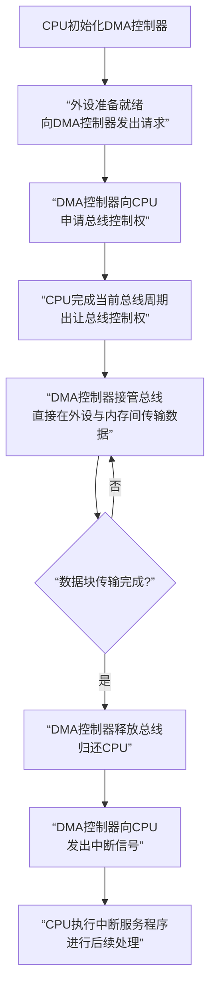

非常好！我们已经学习了效率低下的**程序查询**和承上启下的**中断方式**，现在来攻克I/O控制的终极武器——**DMA方式**。

虽然你提供的PDF文件内容结束于中断方式的讲解，但我可以根据计算机组成原理的标准知识，为你详细解析DMA方式。

让我们用一个直观的流程图来揭示DMA的核心——**它在“数据传输”这个核心环节上，完全绕开了CPU**。

---

### 🔎 深入DMA的细节

#### 1. DMA的核心思想

DMA的终极目标就是**尽量减少CPU对I/O数据传送的干预**，把CPU从繁重的数据搬运工作中解放出来。

- **程序查询/中断方式**：传输的每个字（或字节）都需要CPU执行指令来参与。
- **DMA方式**：CPU只做“宏观调控”，即初始化 setup 和事后处理 tear down，而整个数据块的传送由专门的硬件（**DMA控制器**）直接完成，无需CPU执行指令。

#### 2. DMA控制器的角色

DMA控制器是一个专用的硬件芯片，它可以看作是**一个在CPU授权下，能直接操作总线的“副驾驶员”**。它内部有几个关键寄存器：

- **内存地址寄存器**：CPU告诉它，数据要放到内存的哪个地址开始的地方。
- **外设地址寄存器**：CPU告诉它，要从哪个外设读/写数据。
- **字节计数器**：CPU告诉它，这次要传输的数据总量有多大。
- **控制寄存器**：CPU通过它来下达命令（读、写、启动）。

#### 3. DMA的传送过程

结合上方的流程图，这个过程可以分为三个阶段：

1.  **预处理阶段**
    - CPU执行程序，初始化DMA控制器，填写上述所有寄存器。
    - 然后CPU启动外设和DMA控制器，之后CPU就可以去执行其他与此次I/O无关的任务了。

2.  **数据传送阶段**
    - 当外设准备好一个数据单元（比如一个字节）后，向DMA控制器发出DMA请求。
    - DMA控制器向CPU申请总线的控制权。
    - CPU在**当前总线周期结束后**，会出让总线控制权，并回应一个总线批准信号。
    - **DMA控制器接管总线**，直接控制总线，在外设和内存之间完成**一个数据单元**的传送。
    - 传送结束后，DMA控制器**立即释放总线**，将其交还给CPU。
    - 同时，DMA控制器会修改内存地址和字节计数器，为下一次传送做准备。
    - 重复此过程，直到整个数据块传输完成。

3.  **后处理阶段**
    - 当字节计数器减到0时，表示整个数据块传输完毕。
    - DMA控制器向CPU发出一个**中断请求**。
    - CPU响应中断，执行相应的中断服务程序，来检查本次DMA传输是否正确，并做后续的善后处理。

#### 4. DMA的工作方式

DMA控制器在数据传输阶段与CPU配合，主要有三种方式：

- **停止CPU访问**：DMA传输时，CPU完全停止访问主存。控制简单，但CPU处于不工作状态，效率最低。
- **周期挪用**：DMA“偷用”CPU正在执行的某个总线周期来完成传输。这是**最常用的方式**，它巧妙地利用了CPU正在进行的并不访问内存的操作（如ALU运算），或者强制CPU等待一个内存周期。如上图流程所示。
- **DMA与CPU交替访问**：将CPU周期分为两部分，一部分专供DMA使用，一部分专供CPU使用。这种方式不需要总线控制权的申请、建立和归还过程，效率最高，但硬件逻辑也最复杂。

---

### 💎 核心总结：三种方式的终极对比

| 特性 | 程序查询方式 | 中断方式 | DMA方式 |
| :--- | :--- | :--- | :--- |
| **数据传输的参与者** | **CPU**（全程主动查询） | **CPU**（响应中断，执行服务程序） | **DMA控制器**（硬件直接控制） |
| **CPU效率** | **最低**（忙等待） | **中等**（有保护现场等开销） | **最高**（仅在头尾参与） |
| **并行能力** | 无 | CPU与外设并行 | CPU与外设、传输过程高度并行 |
| **硬件复杂度** | 简单 | 中等 | 复杂（需DMA控制器） |
| **适用场景** | 低速、简单系统 | 中低速设备，需及时响应的场景 | **高速、大批量**数据传输（如磁盘、网络卡、显卡） |

**简单比喻收官：**

- **程序查询**：采购员自己不停地跑去仓库看货到了没，然后自己搬。
- **中断方式**：采购员在仓库下了单就去忙别的，仓库备好货后打电话叫他，他**亲自过来**搬一趟，然后回去继续工作。
- **DMA方式**：采购员雇了一个搬运队（DMA控制器），他只需要告诉搬运队“把这100箱货从A仓库搬到B仓库的1号到100号位置”，然后就可以走了。搬运队**自己调用卡车（总线）**，完成所有搬运工作，全部干完后给采购员发个短信（中断）报告一下。

希望这个详细的讲解能让你对DMA方式有一个清晰而深刻的理解！这是现代计算机实现高性能I/O的基石。