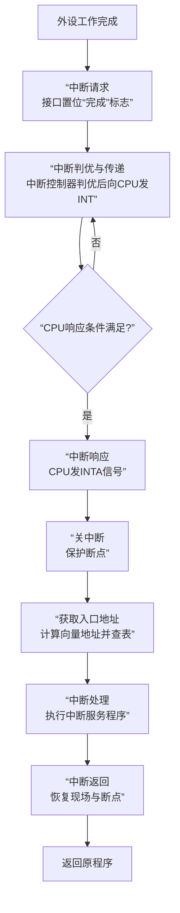

太好了！这份PDF详细讲解了**中断方式**，这是三种I/O控制方式中承上启下的关键一环。它既比程序查询方式高效，又是理解更复杂的DMA方式的基础。

根据你的要求，我们将分两步进行学习：**首先梳理中断机制的各种核心概念**，**然后串联起整个中断处理流程**。

---

### 📖 第一部分：中断机制核心概念解析

#### 1. 中断的定义与实质
- **定义**：CPU暂停当前正在运行的程序，转去处理某个随机发生的紧急事件（由**中断源**发出请求），处理完后自动返回原程序继续执行。
- **实质**：一种**程序切换**。
  - **方法**：保存当前程序的断点（下一条指令地址），获取中断服务程序的入口地址。
  - **时机**：在**一条指令执行结束时**进行切换，保证程序的原子性和正确性。

#### 2. 中断的特点与分类
- **特点**：**随机性**。中断请求的发生是随机的，CPU无法预知。
- **重要分类**：
  - **可屏蔽中断 vs. 非屏蔽中断**：
    - **可屏蔽中断**：可以通过指令（如`CLI`）清除中断允许标志位（IF）来**屏蔽**（忽略）的中断。大部分外设中断属于此类。
    - **非屏蔽中断**：**无法屏蔽**，必须立即响应，通常用于处理电源掉电等紧急情况。
  - **向量中断 vs. 非向量中断**：
    - **向量中断**：由**硬件**直接提供中断服务程序的**入口地址**。响应速度快，是现代计算机的主流方式。
    - **非向量中断**：CPU响应后，所有中断都到一个**固定地址**执行一段**查询程序**，由**软件**判断是哪个中断源并跳转到对应的服务程序。速度慢，但硬件简单。

#### 3. 中断优先级与屏蔽
当多个中断源同时请求时，需要决定先处理哪个。
- **优先级**：给每个中断源分配一个优先级别。高级别中断可以打断低级别中断的服务程序，这就是**多重中断（中断嵌套）**。
- **实现方式**：
  - **软件查询**：优先级由查询顺序决定，灵活但慢。
  - **硬件判优**：速度快，主要有两种：
    - **链式排队**：优先级由设备在链路上的物理位置决定，固定不变。
    - **中断控制器（如8259A）**：专用芯片管理中断，可以灵活编程设置优先级，功能强大。

#### 4. 中断向量表（IVT）
这是理解向量中断的核心！
- **中断向量**：一个数据结构，包含**中断服务程序的入口地址**（在IBM PC中还包括程序状态字）。
- **中断向量表**：所有中断向量的集合，像一张**服务程序目录表**，存放在内存的固定区域（如IBM PC放在内存最低的1KB空间）。
- **向量地址**：查找中断向量表的**索引**。通常由**中断类型码 × 4**计算得出（因为每个向量占4个字节）。

> **简单比喻**：中断类型码像一个人的身份证号，向量地址是根据身份证号算出的档案柜编号，中断向量就是档案袋，里面装着这个人的详细住址（服务程序入口地址）。

---

### 🔄 第二部分：中断完整处理流程（以向量中断为例）

整个流程可以分为**中断请求、中断响应、中断处理、中断返回**四个阶段。

下面我们来详细解析图中的每一个步骤。

#### **阶段一：中断请求**
1.  **条件成熟**：外设完成一次操作（如键盘有键按下、数据读完）。
2.  **接口发出信号**：外设接口置位“完成”状态寄存器，并产生中断请求（`IREQ`）。

#### **阶段二：中断响应**
这是由**硬件（CPU和中断控制器）** 自动完成的关键阶段。
1.  **请求汇集与判优**：中断控制器（如8259A）接收所有中断请求，进行屏蔽和优先级判断，将当前最高优先级的请求以`INT`信号发给CPU。
2.  **CPU检查响应条件**：CPU在**当前指令执行结束时**，检查是否响应中断，条件包括：
    - 有中断请求（`INT`有效）。
    - CPU处于**开中断**状态（IF=1）。
    - 没有DMA等更高级的请求。
    - 该中断未被屏蔽。
3.  **中断响应**：若条件满足，CPU进入**中断周期**，发出中断响应信号`INTA`。
4.  **执行中断隐指令**（硬件自动完成一系列操作）：
    - **关中断**：为防止现场被破坏，先自动关中断（IF=0）。
    - **保存断点**：将当前程序计数器（PC）的值压入堆栈。
    - **获取入口地址**：CPU从中断控制器取回**中断类型码**，计算出**向量地址**，访问**中断向量表**，读出**中断服务程序的入口地址**并送入PC。

#### **阶段三：中断处理**
此阶段由**软件（中断服务程序）** 执行。
1.  **保护现场**：服务程序首先用`PUSH`指令将相关寄存器的值压栈保存。
2.  **开中断**：如果允许**多重中断**，此时会用`STI`指令开中断（IF=1），允许更高级的中断打断自己。
3.  **执行核心服务**：执行真正的I/O操作，如数据传送。
4.  **恢复现场**：关中断后，用`POP`指令将保存的寄存器值恢复。
5.  **中断返回**：执行`IRET`指令，该指令会从堆栈中**恢复断点（PC）** 和**恢复标志寄存器（包括IF标志）**，CPU从而返回原程序继续执行。

---

### 💎 核心总结

- **核心思想**：**从CPU主动查询变为外设主动通知**，实现CPU与外设的并行工作。
- **关键硬件**：**中断控制器**，它管理了中断的屏蔽、判优和向量生成。
- **关键数据结构**：**中断向量表**，它是连接中断请求和中断服务程序的桥梁。
- **流程精髓**：**“硬件响应，软件处理”**。响应过程是硬件自动、固定的；处理过程则由灵活的软件程序完成。

希望这个从概念到流程的讲解能帮助你彻底理解中断机制！如果还有任何疑问，随时可以提出。