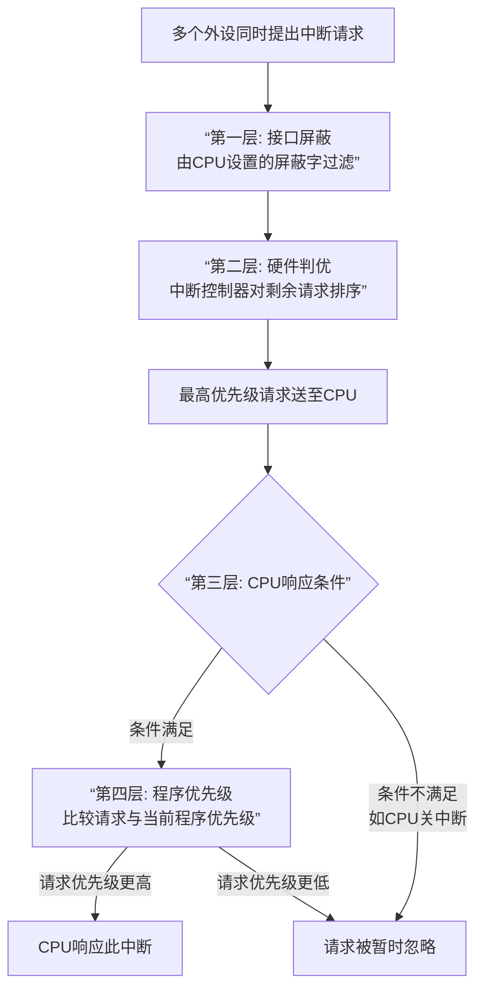

非常好！这是一个非常核心的问题。中断优先级判断（也叫**中断判优**）是中断系统的“交通警察”，它决定了当多个中断同时发生时，CPU应该先响应谁，以及谁可以打断谁。

整个优先级判断的流程是一个多层次的、由软硬件协同完成的筛选过程。它不仅仅发生在多个外设之间，也发生在**外设与CPU当前正在执行的程序**之间。

为了让这个复杂的流程一目了然，我为你绘制了以下流程图，它展示了中断请求从产生到被响应所需经历的层层筛选：

下面，我们来详细解读图中的每一个判断层次：

---

### 🔎 详解优先级判断的四个层次

#### **第一层：接口屏蔽（软件可编程）**

这是最基础的一层过滤，在**每个外设的接口**中完成。
- **机制**：CPU可以通过软件向**中断屏蔽寄存器**写入一个**屏蔽字**。每一位对应一个外设。
  - 如果某一位被置为 `1`，则表示**屏蔽**该外设的中断请求，即使它发出了请求，也无法传递出去。
  - 如果某一位为 `0`，则**允许**该请求通过。
- **特点**：**灵活性高**。操作系统可以根据当前任务的重要性，动态地调整屏蔽字，从而改变中断响应的顺序。这相当于给了软件一个“一票否决权”。

> **举例**：在打印一个大文件时，CPU可以暂时屏蔽键盘中断，以确保打印流不被打断。

#### **第二层：硬件判优（固定或可编程）**

所有通过第一层屏蔽的中断请求，会汇集到**中断控制器**（如经典的8259A PIC或现代的IOAPIC）。由它来决出哪一个优先级最高。主要有两种硬件实现方式：

1.  **链式判优（菊花链）**
    - **机制**：所有设备共享一条中断请求线，但在物理上串行连接。中断批准信号 `INTA` 像接力一样从一个设备传到下一个。
    - **优先级**：**离CPU近的设备优先级高**。当一个设备收到 `INTA` 时，如果它发出了请求，它就“截获”这个信号，并把自己的中断号送上数据总线；如果它没有请求，就把 `INTA` 传递给下一个设备。
    - **特点**：硬件电路简单，但**优先级固定，不可改变**。

2.  **中断控制器判优（如8259A）**
    - **机制**：这是一个专用的、可编程芯片。CPU可以预先设置它的工作模式，比如：
      - **完全嵌套模式**：IRQ0优先级最高，IRQ7优先级最低，固定不变。
      - **优先级循环模式**：优先级可以动态轮转，防止低优先级设备完全得不到响应。
    - **工作流程**：
      - 中断请求寄存器接收所有请求。
      - 中断屏蔽寄存器根据设置进行第二道屏蔽。
      - 优先级裁决器将当前未屏蔽的请求中，优先级最高的那个选出来，然后向CPU发送公共的 `INT` 信号。
    - **特点**：**功能强大，灵活可控**，是现代计算机的主流方式。

#### **第三层：CPU当前状态判断**

经过前两层，只有一个最高优先级的中断请求被送到了CPU面前。但CPU是否立即响应，还取决于自身的状态，这可以看作是**CPU当前程序与外设请求之间的判优**。

CPU响应的**必要条件**：
1.  **CPU处于开中断状态**：即中断允许标志位 `IF = 1`（对于可屏蔽中断）。如果 `IF=0`（关中断），任何可屏蔽中断都会被忽略。
2.  **没有更紧急的事件**：例如，没有不可屏蔽中断和总线请求同时发生。通常的优先级顺序是：**内部故障 > DMA请求 > 外部可屏蔽中断**。
3.  **当前指令已执行完毕**：中断响应发生在指令周期的最后一个机器周期。

#### **第四层：程序优先级判断**

在一些性能更强的计算机中，CPU当前正在执行的程序本身也有一个**优先级**（存储在程序状态字PSW中）。
- **机制**：当CPU收到一个中断请求时，会将这个请求的优先级与当前程序的优先级进行比较。
- **规则**：
  - **只有当中断请求的优先级 > 当前程序的优先级时**，CPU才会响应这个中断（实现**多重中断**）。
  - **如果中断请求的优先级 ≤ 当前程序的优先级**，CPU会暂时不响应，直到当前程序执行完毕或程序优先级降低。

---

### 💎 总结

中断优先级判断是一个精细的、立体的过滤网络：

1.  **屏蔽字**（软件）：**“允不允许你来竞争？”**
2.  **硬件判优**（硬件）：**“来的这么多人里，谁最优先？”**
3.  **CPU状态**（硬件）：**“我现在方不方便接待？”**
4.  **程序优先级**（软硬件结合）：**“你的事是否比我手头的事更重要？”**

这个过程确保了计算机系统既能及时响应紧急事件，又能保证核心任务的连续运行，是系统稳定性和实时性的关键。