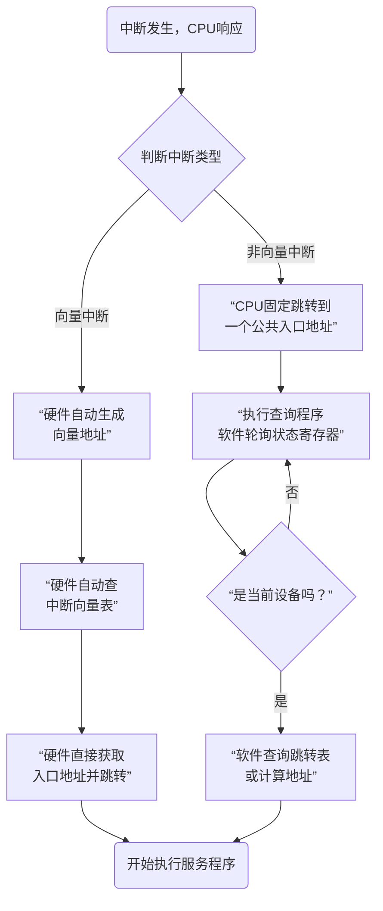

非常好！这个问题触及了中断机制中一个非常关键的设计抉择：**CPU在响应中断后，如何找到并执行对应的中断服务程序？**

“向量中断”和“非向量中断”部分讲述的，正是解决这个问题的两种不同技术路径和具体操作。它们核心的区别在于：**由谁来主导、以及如何找到中断服务程序的“家门牌号”（入口地址）。**

为了让这个核心区别一目了然，我为你绘制了以下流程图来对比两者的操作过程：

---

### 🔎 详解两种中断的操作

下面我们结合上图，来详细解析这两种方式的具体操作。

#### 1. 向量中断 - “精准导航，硬件直达”

这是一种由**硬件**直接、自动提供入口地址的方式。就像有个智能秘书，一接到哪个部门的电话，就直接告诉你该部门经理的准确位置。

- **核心操作流程（对应图中左侧路径）**：
  1.  **硬件产生向量号**：CPU在中断响应周期内，通过中断控制器（如8259A）或直接从中断请求线上，获得一个唯一标识中断源的**中断类型码**（或称向量号）。
  2.  **硬件计算向量地址**：CPU内的硬件电路自动执行 `向量地址 = 中断类型码 × 每个向量占用的字节数`（例如，在IBM PC中，每个入口地址占4字节，所以是 `×4`）。
  3.  **硬件查表**：计算出的**向量地址**，就是**中断向量表**的索引。CPU硬件直接使用这个地址去访问内存中固定的中断向量表区域。
  4.  **硬件跳转**：从向量表中读出对应的**中断服务程序入口地址**，直接加载到程序计数器中。CPU转而从这个新地址开始取指执行，即进入了对应的中断服务程序。

- **特点**：
  - **速度快**：整个过程由硬件在中断响应周期内一气呵成，无需执行额外的软件指令进行查询。
  - **硬件成本高**：需要支持生成向量号、中断向量表等硬件电路。
  - **是现代高性能计算机的主流方式**。

#### 2. 非向量中断 - “总台查询，人工转接”

这是一种由**软件**查询并确定入口地址的方式。就像所有电话都先打到公司总台，接线员逐个询问“您找哪个部门？”，然后再帮你转接。

- **核心操作流程（对应图中右侧路径）**：
  1.  **固定入口**：CPU响应任何非向量中断时，都**固定地跳转到同一个内存地址**。
  2.  **执行查询程序**：这个固定地址处存放的是一段**中断查询程序**（软件）。
  3.  **软件轮询**：该查询程序按预先设定的**优先级顺序**，依次去检查各个外设接口的**状态寄存器**中的“中断请求”位。
  4.  **识别中断源**：当检查到某个外设的状态位表明是它发出的请求时，查询程序就确认了中断源。
  5.  **软件跳转**：查询程序根据识别出的中断源，通过一条跳转指令，转入到该设备对应的中断服务程序。

- **特点**：
  - **速度慢**：因为需要执行一段可能很长的查询程序，延迟较大。
  - **灵活性高**：优先级可以通过修改查询顺序而轻松改变，非常灵活。
  - **硬件成本低**：不需要复杂的向量生成电路，所有设备可以共享一条中断请求线。
  - **常用于微控制器或对成本敏感的简单系统中**。

---

### 💎 核心总结与对比

| 特性 | 向量中断 | 非向量中断 |
| :--- | :--- | :--- |
| **核心角色** | **硬件** 为主导 | **软件** 为主导 |
| **入口地址获取** | 硬件**自动**查表，**直接**获得 | 软件**轮询**查询，**间接**跳转 |
| **性能速度** | **快** | **慢** |
| **硬件复杂度** | 高 | 低 |
| **灵活性** | 优先级通常由硬件固定 | 优先级可通过软件查询顺序灵活调整 |
| **应用场景** | 通用计算机、高性能系统 | 微控制器、简单嵌入式系统 |

**简单比喻收官：**

- **向量中断**：像去一个大图书馆，你知道你要找的书的**确切索书号**（中断类型码），直接到对应的书架（向量地址）上就能拿到书（入口地址）。
- **非向量中断**：像去一个没有分类的仓库，你必须问管理员（查询程序），他需要从第一个箱子开始翻，直到找到你想要的那本书（识别中断源），才能告诉你它在哪。

所以，这部分内容讲述的正是CPU在说“好的，我收到中断了”之后，**如何“找到处理问题的具体负责人”的这一关键操作过程**。