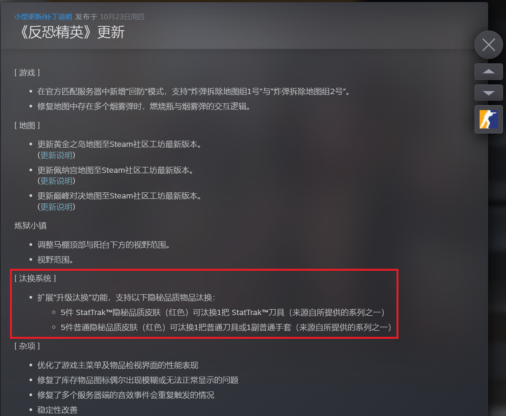
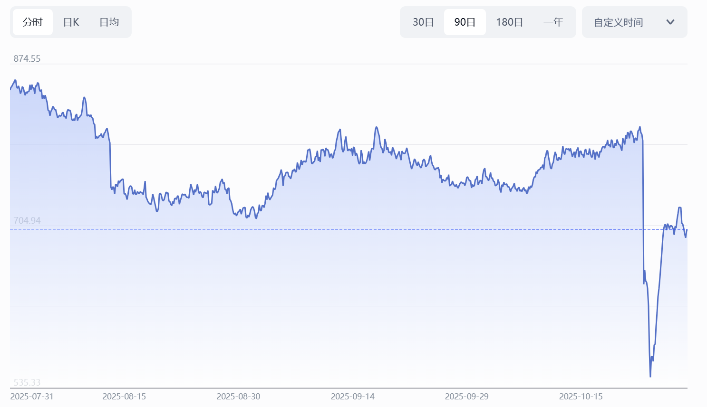
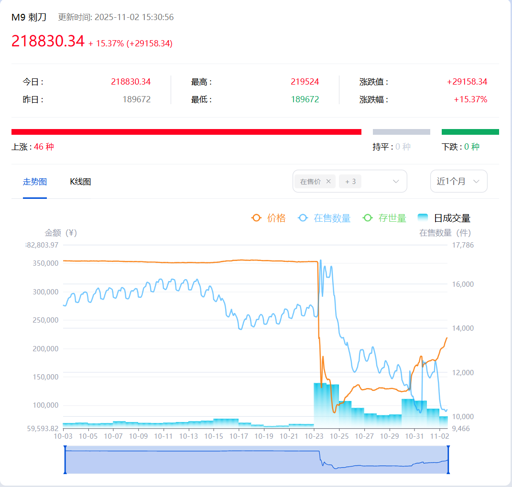

# CS2皮肤市场崩盘金融分析报告

> ### 本报告将依循  **背景-事件-分析-启示**  4个层次进行分析。

# 背景

## CS2虚拟资产市场形成

### 早期萌芽阶段（2018年前后）

CS2饰品市场的形成可以追溯到2018年左右，当时《CS:GO》的饰品交易开始在Steam平台上悄然兴起。正如天津资深玩家"大饼"所述："大概在2018年之前便有人开始炒皮肤了。" 

初期，饰品交易主要在Steam平台的官方市场进行，玩家通过开箱获取饰品后，通过第三方平台（如BUFF、悠悠有品）进行交易。交易流程是：买家在第三方平台付款，卖家从Steam确认交易并发货，经过7天"冷却期"后才能提现。

### CS:GO时期的市场基础（2017-2023）

CS:GO时期奠定了饰品市场发展的基础：

1. **开箱机制的形成**：开箱机制本质是一种"盲盒"玩法，获得稀有饰品的概率极低（金色品质刀具概率仅为0.26%）。这种极低的爆率设计，使得稀有饰品长期处于稀缺状态。

2. **市场生态形成**：随着玩家数量增长，市场逐渐形成了完整的生态链：
   - "倒狗"（投机者）批量扫货、垄断特定皮肤，制造稀缺性后再高价抛售
   - 第三方交易平台成为市场核心，提供便捷的交易渠道
   - 饰品逐渐从装饰品转变为"数字资产"

3. **价格飙升**：2018年，AWP | 巨龙传说（"龙狙"）以6.1万美元成交，部分稀有纪念品龙狙价格曾达到350万元人民币，成为虚拟世界的"硬通货"。

### CS2发布与市场飞跃（2023年9月-2025年3月）

2023年9月28日，Valve正式发布《CS2》，成为《CS:GO》的正统续作。市场经历了短暂过渡期后迅速反弹：

1. **市场平稳过渡**：如资料[2]所述："起初，市场因《CS:GO》向《CS2》的过渡出现了一些波动。但很快，市场便恢复了稳定。这一变化还推动了饰品市场达到了新的高度。"

2. **市场爆发增长**：
   - 2023年，饰品市场总市值突破42.8亿美元
   - 全球玩家每年开启武器箱超过4亿个，供需失衡推动箱子价格持续攀升
   - 2024年，一款AK-47皮肤（蓝顶淬火661暗金）成交价超过百万美元
   - 2025年3月7日，饰品市场总市值达42亿7757万4722美元

3. **市场生态成熟**：
   - 饰品从"装饰品"转变为"投资品"，被投资者视为"新型数字资产"
   - 专业"倒爷"（投机者）出现，形成完整的投资链条
   - 职业选手的饰品被粉丝追捧，进一步推动市场热度

### 市场巅峰与泡沫形成（2025年3-10月）

市场达到顶峰后，泡沫开始形成：

1. **市值突破58亿美元**：根据Pricempire数据，从突破50亿美元到58亿美元，市场仅用五个月时间，展现出快速增长趋势。

2. **投机氛围浓厚**：
   - 玩家将饰品视为"投资品"，而非游戏道具
   - 交易市场形成类似股市的生态
   - 专业"导购"（倒爷）散播"年轻人第一桶金"的论调

3. **Valve的微妙立场**：
   - Valve似乎一直在试图将玩家从第三方网站引流至Steam社区市场，以便从交易税费中榨取更多收入
   - 2025年9月，Valve实施了"T+7"制度（二级市场购买的饰品需等待7天冷却期）

## 崩盘转折点（2025年10月23日）(今天的汇报事件)

2025年10月23日，Valve发布"以旧换新"系统，彻底改变了市场规则：

1. **核心机制变更**：允许玩家用5件普通隐秘品质皮肤（红色）合成一把普通刀具或手套，使原本通过开箱获得的稀有饰品获取方式大幅降低。

2. **市场瞬间崩盘**：
   - 市场总估值从约59-60亿美元暴跌至42亿美元，一日蒸发约17-20亿美元
   - 高端饰品价格普遍下跌40%-50%，部分单品跌幅超50%
   - 交易平台交易量激增500%，导致平台全线卡死

3. **市场本质暴露**：正如资深分析师所言，"虚拟资产的价值完全依赖于规则制定者的一行代码"，市场崩盘揭示了虚拟资产市场的根本性风险——缺乏实体经济支撑，完全建立在"玩家集体共识"基础上。


## 概括

### CS2市场的商品与交易机制

- CS2市场的商品就是开箱得到的皮肤，开出的概率越低，交易的价格往往越高。
- CS2交易的平台

  - Steam游戏平台

  - 三方交易平台(BUFF、悠悠有品)

- 交易机制

  - 三方平台下单，卖方通过Steam直接发货，买方付钱。

### 虚拟资产市场形成已久，规模大

- 《CS2》饰品市场已形成类似股市的二级交易生态
- 由于稀缺性与"保值率"共同推动，饰品价格持续攀升
- 吸引非玩家群体参与，出现专职饰品交易操盘手
- 饰品租赁业务兴起，年化回报率达5%-15%

### Valve的前期干预(2025年开始)

- 7月：要求二级市场购买的饰品需等待7天冷却期("T+7"制度)
- 9月：将新武器箱获取方式从抽奖改为直购

# 事件

### 事件概述

**2025年10月23日**，Valve公司发布《CS2》重大更新，导致游戏饰品市场在24小时内崩盘，市场总估值从约59-60亿美元暴跌至**42亿美元**，一日蒸发约**17-20亿美元**，跌幅高达**39.6%**。高端饰品价格普遍腰斩，部分单品**跌幅超50%**，成为"CS饰品市场历史上最大规模的单日崩盘"。

### 崩盘根本原因

**核心机制变化**：Valve引入了"以旧换新合同"(Trade Up Contract)功能，允许玩家用5件普通隐秘品质皮肤(红色)合成一把普通刀具或手套，5件StatTrak™隐秘品质皮肤可合成1把StatTrak™刀具。



**影响**：

- 之前高端饰品(刀具、手套)只能通过**开箱抽奖(掉落率仅0.26%)或高价购买获得**
- 本次更新使稀缺性机制彻底瓦解，相当于"用5件铜制元宝兑换1件黄金"
- 以"运动手套｜迈阿密风云"为例，价格从最高14万元直降至6万元左右，跌幅超60%

## 市场影响

### 价格与交易量

- 高端饰品价格普遍下跌40%-50%，部分单品腰斩
- 交易平台(如CSFloat、SkinPort)交易量激增500%，导致平台全线卡死
- 饰品指数从10月22日的1662.54点，24小时内跌至564.21点，两天跌近40%

### steam交易平台指数(三方平台数据)



### 个别饰品价格走势



### 玩家损失

- 有玩家"3小时内蒸发500万"
- 有玩家"22万元投资，两天亏掉11万"
- 巴西球星内马尔个人饰品库存缩水约5万美元
- ~~有报道称一名中国大学生因损失约15万RMB(2万美元)后跳楼~~

# 分析

# 一、刀皮价格的以旧换新和直接开箱的理论值分析与对比

## "以旧换新"模式下刀皮价格理论值

### 1、以旧换新核心计算模型

根据CS2"以旧换新"系统规则，获取一把刀具需要：

- **5把隐秘品质（红色）皮肤**
- 每把隐秘品质皮肤的官方掉落概率为 **3.2%**

我们可以构建一个完整的概率模型来推导刀具的理论价格。

---

### 2、开箱获取红色皮肤的概率分析

#### 单次开箱获得隐秘品质的概率

- 官方公布概率：**3.2%** (0.032)

#### 获得1把隐秘品质皮肤所需的平均开箱次数

使用几何分布的期望值公式：

```
E(X) = 1/p = 1/0.032 ≈ 31.25次
```

#### 获得5把隐秘品质皮肤的期望开箱次数

由于每次开箱独立，期望值可线性相加：

```
E(总) = 5 × 31.25 = 156.25次
```

---

### 3、成本构成分析

#### 开箱成本(1￥ ~ 400￥不等)

假设：

- 单个箱子价格：**$2.50** (市场常见价格)
- 单把钥匙价格：**$2.50**

则单次开箱成本：

```
$2.50 (箱子) + $2.50 (钥匙) = $5.00
```

#### 总开箱成本

```
156.25次 × $5.00 = $781.25
```

---

### 4、理论以旧换新刀皮价格推导

#### 基础理论价格

基于开箱成本，一把刀具的理论最低价格应为：

```
$781.25 ≈ $780-800
```

#### 考虑交易摩擦成本

实际交易中还需考虑：

- Steam交易税：约15%
- 平台手续费：约5-10%

调整后理论价格：

```
$781.25 × (1 + 0.15 + 0.08) ≈ $781.25 × 1.23 ≈ $960
```

#### 考虑时间成本与风险溢价

- 时间成本（开箱、交易）
- 价格波动风险
- 流动性风险

增加约20%风险溢价：

```
$960 × 1.20 ≈ $1,150
```

## "直接开箱"模式下刀皮价格理论值

### 1、官方开箱刀皮掉落概率

根据CS2官方数据，刀具（金色品质）的掉落概率为：

- **0.26%** (即 1/384.6)

#### 获得1把刀具的期望开箱次数

使用几何分布期望值公式：·

```
E(X) = 1/p = 1/0.0026 ≈ 384.6次
```

### 2、直接开箱成本分析

#### 单次开箱成本

假设：

- 箱子价格：**$2.50**
- 钥匙价格：**$2.50**
- 单次开箱总成本：**$5.00**

#### 获得1把刀具的期望总成本

```
384.6次 × $5.00 = $1,923
```

#### 考虑交易摩擦成本

- Steam交易税：约15%
- 平台手续费：约8%

调整后理论成本：

```
$1,923 × (1 + 0.15 + 0.08) = $1,923 × 1.23 ≈ $2,365
```

#### 加入风险溢价

考虑时间成本、心理压力、价格波动等因素，增加20%风险溢价：

```
$2,365 × 1.20 ≈ $2,838
```

## "直接开箱"与"以旧换新"系统的对比

| 获取方式     | 期望开箱次数  | 理论成本          | 实际粗略成本范围        |
| -------- | ------- | ------------- | ------------- |
| **直接开箱** | 384.6次  | $1,923-$2,838 | $2,000-$3,500 |
| **以旧换新** | 156.25次 | $780-$1,150   | $800-$1,500   |
| **节省比例** | -       | **60%以上**     | -             |

> **结果**："以旧换新"系统将获取刀具的成本降低了60%以上，并且直接粉碎了刀具的稀缺性，这是市场崩盘的根本原因。

## 与市场价格对比

| 价格类型       | 以旧换新金额 | 直接开箱金额          | 说明             |
| ---------- | ------ | --------------- | -------------- |
| **理论基础成本** | $780   | $1,923          | 纯开箱成本          |
| **含交易成本**  | $960   | $2,365          | 加入税费和手续费       |
| **含风险溢价**  | $1,150 | $2,838          | 最完整的理论价格       |
| **当前市场价格** | ?      | $6,000-$15,000+ | 实际交易价格，仍远高于理论值 |

## 结论

#### 因稀缺性和cs市场内职业交易员囤货抬价的原因，导致过去开箱获得的刀皮价格远高于期望价

#### 从概率论角度，以旧换新模式的出现，刀皮将不再具有稀缺性，CS2刀皮的理论价格将回归趋近:

**$780 - $1,150**(上下浮动)

# 二、CS2饰品市场的分析，为什么会有大崩盘风险

**CS2的市场，交易模式，与股市极为相似，但是又有区别**

## 与股市的对比

### 相同点

| 对比维度     | CS2饰品市场                        | 股市                       |
| -------- | ------------------------------ | ------------------------ |
| **交易机制** | 采用订单簿机制，价格走势图类似K线图             | 采用订单簿机制，价格走势图类似K线图       |
| **投机行为** | 大量投机者入场，存在"博傻理论"（价格依赖于下一个接盘者）  | 大量散户投机，存在"追涨杀跌"和"FOMO"心理 |
| **市场周期** | 有明显的"泡沫形成与回调周期"（信心增长→贪婪→恐慌→理性） | 有明显的"牛市与熊市"周期            |
| **交易策略** | 常见策略包括囤货、造势、拉升、出货              | 常见策略包括价值投资、趋势交易、波段操作     |

### 不同点

| 对比维度       | CS2饰品市场                             | 股市                            |
| ---------- | ----------------------------------- | ----------------------------- |
| **价值基础**   | 价值完全建立在玩家集体共识和新用户持续流入上，无实际使用价值      | 价值基于企业资产、未来现金流和实际经营状况，有实体经济支撑 |
| **规则制定者**  | 游戏公司（Valve）单方面制定规则，可随时更改（如"以旧换新"机制） | 监管机构制定规则，变动需经过漫长论证和过渡期        |
| **交易限制**   | 有T+7冷却期、30天惩罚机制等，增加交易复杂性            | 有T+1交易制度、涨跌幅限制等规则             |
| **交易物品性质** | 虚拟物品（皮肤、刀具、手套），无实际使用功能（仅为视觉装饰）      | 企业股权，有实际价值（分红、投票权、企业资产）       |
| **监管环境**   | 监管较少，存在灰色地带和不确定性，有欺诈和黑市交易风险         | 有严格监管，有规范的交易所和相关法规            |
| **泡沫破裂机制** | 一次游戏公司更新公告即可导致市场崩盘（如"以旧换新"机制）       | 泡沫破裂需要经过市场长期调整和政策影响           |

## CS2虚拟市场崩盘原因

> "在虚拟世界中，游戏公司的一行代码、一则公告，就足以让亿万财富蒸发。"

### 1. 价值基础薄弱，缺乏实体经济支撑

虚拟市场最根本的问题是**缺乏实体经济支撑**，价值完全依赖于"玩家集体共识"或"市场情绪"，而非实际使用价值：

- **CS2饰品市场**：如所述，"《CS2》饰品本身并不附带任何属性加成，其本质仅为视觉装饰"，"被玩家视为高保值虚拟资产"，但本质上只是游戏内的装饰品。

- **对比传统市场**：如对比指出，"传统投资如股票、基金等，有相对成熟的市场和监管体系，投资标的通常有实际的业务和资产"。

### 2. 规则制定者单方面控制

虚拟市场的一个致命弱点是**规则制定者可以随时改写规则**，导致市场瞬间崩盘：

- **CS2市场**："此次市场波动的原因为，游戏公司Valve10月23日公布的一项重大更新"，"原来只可以通过开箱获得的珍贵饰品，现在可以通过便宜的道具合成"，"相当于将获取路径从抽奖变为定做"。

- **专家观点**："在传统金融市场，监管政策的变动需要经过漫长的论证和过渡期。但在虚拟世界中，游戏公司的一行代码、一则公告，就足以让亿万财富蒸发"。

### 3. 高度投机性与泡沫化

虚拟市场往往被炒成"投资品"，形成严重泡沫：

- **CS2市场**："近年来，因'稀缺性'与'保值率'共同推动，《CS2》饰品市场价格持续攀升。这一趋势吸引了不少非玩家群体的关注，逐渐形成以饰品为标的的'虚拟资产'交易生态"。

- **虚拟货币市场**："虚拟币市场具有较高的投机性，投资者的情绪容易受到市场传闻、社交媒体言论等因素的影响"。

### 4. 监管缺失与不规范

虚拟市场普遍处于监管灰色地带：

- **CS2市场**："V社并非上市公司，游戏皮肤交易也不属于证券交易，很显然本次CS饰品市场的变动并不属于证监会(SEC)的管辖范围"。

- **虚拟货币市场**："不同国家和地区对虚拟货币的监管政策存在差异，且监管政策具有不确定性"。

### 5. 信息不对称与市场操纵

虚拟市场中存在严重的信息不对称和操纵行为：

- **CS2市场**：知识库[6]指出，"平台上有大量被玩家俗称为倒狗的投机者。他们携带大资金入场，批量扫货、垄断特定皮肤，制造市场稀缺性后再高价抛售，本质上就是一种囤积居奇、哄抬价格的行为"。

- **虚拟货币市场**：知识库[7]提到，"部分大型投资者或机构有能力操纵市场价格。他们可以通过大量买卖虚拟货币来影响市场供需关系，进而操纵价格走势"。

### 6. 价格波动剧烈，缺乏稳定机制

虚拟市场缺乏价格稳定机制，波动性极大：

- **CS2市场**："饰品市场已普遍经历一轮大幅回调，多款此前的高价装备出现大幅下跌"，"饰品总市场估值一夜蒸发近20亿美元"。

- **虚拟货币市场**："比特币一度跌破9.5万美元大关，日内跌幅超过7%"，"24小时内的跌幅更是超过8%"。

### 7. 用户情绪驱动市场

虚拟市场受情绪影响极大，形成"恐慌-抛售"的恶性循环：

- **CS2市场**：玩家表示，"这个市场已经疯狂太久了"。

- **虚拟货币市场**："市场情绪的变化也是造成这次崩盘的重要因素。虚拟货币市场以其高度投机性著称，投资者往往受到市场情绪的驱动。在上涨趋势中，投资者更容易产生'贪婪'的心理，而一旦市场出现下滑，'恐惧'便迅速蔓延，形成负反馈循环"。

- **技术性因素**：提到，"技术性抛售也在其中扮演了关键角色。在市场大幅下跌时，许多投资者设定了止损线，一旦价格触及，他们便会自动卖出，从而进一步推动价格下行"。

# 启示

## 启示一：警惕"规则风险"——价值的根基可能一夜崩塌

**核心观点**：当规则制定者也是市场参与者时，普通投资者永远处于劣势。

- **CS2案例**：Valve作为游戏公司，既是CS2饰品市场的"央行"（发行货币）、"证监会"（制定规则），又是最大受益者（交易抽成）。其一纸公告就能让市场蒸发20亿美元。

- **其他例子**：
  
  - **加密货币**：交易所可随时下架代币
  - **A股市场**：政策突变导致行业洗牌（如教培行业）

## 启示二：区分"资产"与"商品"——无现金流支撑的不是投资

**核心观点**：能产生现金流的是资产，只能转手的是商品。

- **CS2案例**：刀具皮肤无法产生分红、利息或租金，其价值完全依赖"下一个接盘者"，本质上是**收藏品**而非**生息资产**。

- **其他例子**：
  
  - **比特币**：无实际使用价值，价格依赖共识
  - **艺术品**：价值主观，流动性差

## 启示三：理解概率与期望——避免"赌徒谬误"

**核心观点**：长期来看，数学期望决定结果，短期运气终将回归均值。

- **CS2案例**：
  
  - 直接开箱获刀期望成本：**$2,838**
  - "以旧换新"成本：**$1,150**
  - 差距达147%，说明"以旧换新"是更优策略

- **其他例子**：
  
  - **彩票**：期望值为负，长期必亏
  - **赌博**：庄家优势确保玩家长期亏损
  - **高频交易**：高昂手续费吞噬利润

## 启示四：坚守能力圈——不懂的领域坚决远离

**核心观点**：理解边界比追逐风口更重要。

- **CS2案例**：许多非玩家(游戏时长不足20小时甚至没有玩过CS2)被"理财新风口"吸引入场，却不知：
  
  - Valve可随时改规则
  - 饰品无实际价值支撑
  - 市场由少数"倒狗"操控

- **其他例子**：
  
  - 普通人投资加密货币
  - 新手炒股追热点

## 总结：构建稳健的投资框架

| 原则       | CS2教训       | 投资应用      |
| -------- | ----------- | --------- |
| **价值基础** | 无实体经济支撑     | 选择有现金流的资产 |
| **规则风险** | Valve单方面改规则 | 避免中心化平台依赖 |
| **概率思维** | 开箱期望值为负     | 追求正期望值策略  |
| **能力圈**  | 非玩家盲目入场     | 只投资理解的领域  |
| **风险管理** | 重仓导致悲剧      | 分散投资，设置止损 |